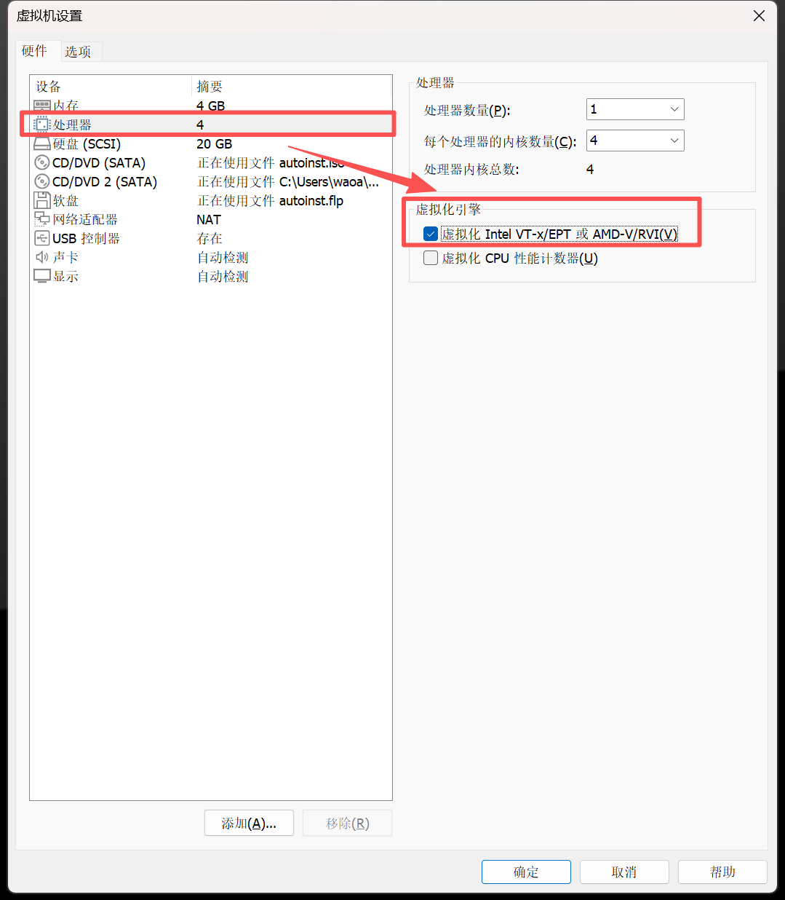
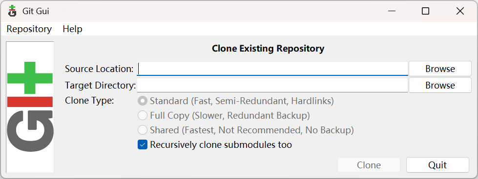
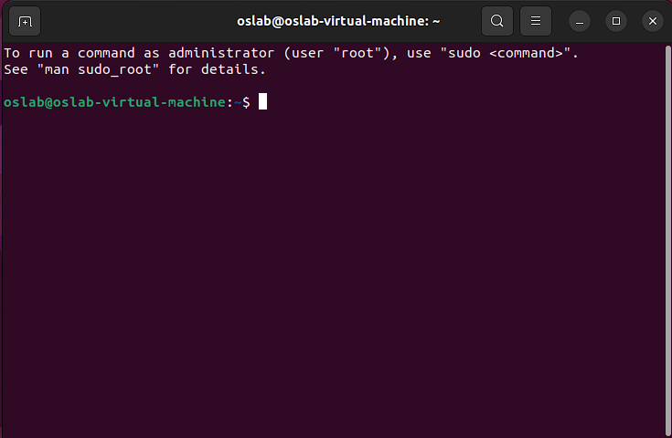
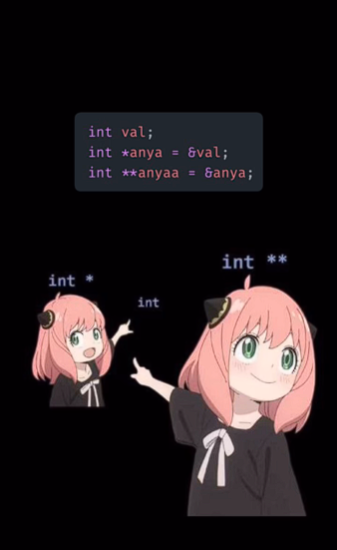

# 前言

## 实验概述

熟悉常见的Linux命令，配置实验环境，通过观察和实践了解Rust语言基础

## 实验内容

1. 安装VMware + Ubuntu22.04
2. 了解Linux常用命令mkdir, cd, ls, touch, mv, cp, sudo, grep
3. 了解Linux重定向`>`，man, |(pipe), cat
4. 创建并运行Rust Hello World程序，了解Rust项目初始结构
5. 了解Rust基础，学习与其他语言相近的关键词和结构
6. 通过Union初见Rust内存安全
7. 完成Rustlings练习

## 系统环境

本课程强烈推荐使用统一系统环境Ubuntu22.04，对于使用其他系统的同学，我们也提供了配置环境的脚本，但需要注意的是此脚本只在Ubuntu22.04中测试过，在其它系统可能需要查看脚本进行系统适配。

> WSL虽然比较好用，但在此还是推荐使用VMware Workstation+ Ubuntu22.04作为开发环境，之前遇到过WSL路径查找的问题，不确定之后会不会遇到其他环境问题，因此使用WSL的同学还是推荐使用VMware，以避免之后无法解决时还是需要重新安装，以下是安装教程：
>
> VMware在2024年宣布虚拟化产品免费，VMware Workstation安装教程：<https://zhuanlan.zhihu.com/p/10399355851> ，由于免费后安装藏得比较深，这里给出直接引导到下载界面的链接，但需要登录：[链接](https://support.broadcom.com/group/ecx/productfiles?subFamily=VMware%20Workstation%20Pro&displayGroup=VMware%20Workstation%20Pro%2017.0%20for%20Windows&release=17.6.3&os=&servicePk=undefined&language=EN&freeDownloads=true)
>
> Ubuntu22.04 desktop的下载链接：<https://releases.ubuntu.com/jammy/ubuntu-22.04.5-desktop-amd64.iso>
>
> Ubuntu22.04 安装到VMware Workstation的教程有很多，这是和我们课程相近的教程：<https://cloud.tencent.com/developer/article/2425681> ，其中用户名和密码都设置成 [名：oslab；密：oslab]即可
>
> 注意虚拟机设置中需要打开 [ 虚拟化Intel-VTx ...] 选项：
>
> 

# 1. Shell

Shell，终端或命令行，是指和操作系统交互的一种用户界面。它和常见的图形化用户界面（GUI）不同，需要用户输入命令以执行程序。如此运行程序实际上与通过GUI点击运行程序是一样的效果，比如我们常用的Git管理工具，它可以使用`git clone xxx.git"`这种输入到Shell运行的命令来克隆一个仓库，也可以通过windows上的Git Gui来克隆一个仓库（GUI是为了方便非计算机人员也能使用计算机服务，我们之后会以Shell为主）：



下面是Ubuntu22.04的一个Shell样例，可以在桌面敲`Ctrl + Alt + T`来唤出



这个界面有光标（白色方块），光标左侧是一个 `$` 符号作为命令提示符，右边所有内容都是用户输入。 `$` 和 `:` 中间的内容是当前路径，这里的 `~` 符号代表当前用户的主目录。 `:` 和 `@` 中间的内容是电脑名称。 `@` 左侧的内容是当前用户名。

## 1.1 常见命令

在Shell中，我们可以使用命令让系统完成几乎所有任务。常见的命令有：

- `mkdir`: 创建文件夹

- `cd`: 切换当前目录
- `pwd`: 获取当前绝对路径

- `ls`: list，列出当前目录下的文件
  - `ls -a` 可以列出隐藏文件
  - `ls -l` 可以列出文件属性，如创建日期、权限等
  - 可以同时启用上述选项 `ls -al`
  - 可以列出其他目录下的文件，如 `ls -al ~` 可以列出主目录下的文件。

- `touch`: 创建空文件

- `mv`: 移动文件，也可以用来重命名文件/文件夹

- `cp`: 复制文件

- `sudo`: 使用最高权限（root权限）运行后面的命令，输入的密码不会显示，这是正常情况  

- `grep`: 通过正则表达式搜索文件内容

其他常用命令包括 `cat` 查看文件内容、 `chown` 改变文件所有权、 `chmod` 改变文件权限、 `shutdown` 关机、 `gcc` 编译c代码等。通常在命令后加上 `--help` 可以使其显示用法，或者使用 `man` 命令查看帮助手册（manual），如 `man sudo` 。

在类Unix系统中，所有文件和文件夹组成了一个树状结构，`.` 代表当前文件夹， `..` 代表上一层文件夹，而 `/` 就表示树的根（root），硬盘内的所有数据都在 `/` 下可以找到。

Shell通常提供了流重定向操作符  ，它表示将输出流重定向到文件或其他流中，如 `ls > ls.txt` 表示将 `ls` 命令的输出保存到 `ls.txt` 文件中。

> 小练习：
>
> 1. 在`~`目录下，创建一个子文件夹称为`hello-os`，进入到子文件夹后创建文件 `os.txt` 并将`Hello Operating System`输入到该文件中，随后查看当前的绝对路径以及当前目录下的所有文件和**隐藏文件**
> 2. 退回上级目录，将刚才在子文件夹重命名为`os`，并将`os/os.txt`给复制到当前路径下
> 3. 打印出`os.txt`的内容，并用grep来匹配`Hello`打印的内容

## 1.2 环境配置

### 1.2.1 基础配置

了解了Shell基础后，我们可以开始配置当前课程所需要的环境，首先我们需要安装Git来拉取环境配置脚本，拉取GitHub仓库并运行环境配置脚本，该脚本除了运行本次课所需的内容还会安装一些后续课程所需的环境：

```sh
sudo apt install -y git
git clone https://github.com/asterinas/summer-ospp-teaching-os.git
cd summer-ospp-teaching-os && bash ./lab1/env-setup.sh
```

### 1.2.2 SSH连接

一直在虚拟机中进行开发会有些不方便，最明显的便是文件传递会有些不便，因此我们推荐配置好vscode + ssh 连接到本地虚拟机 / 远程服务器。

首先，在windows的终端以及（Win + R，输入cmd以开启）中输入`ssh-keygen`中生成ssh的密钥，注意替换邮箱，其余所有的默认即可：

```sh
ssh-keygen -t ed25519 -C "your_email@example.com"
```

在默认位置`C:\Users\{用户名}\.ssh`即可看到有`id_ed25519`和`id_ed25519.pub`两个文件，`id_ed25519`为私钥，完全不用管且不能告诉别人，`id_ed25519.pub`为公钥，这是我们访问服务器所需要的文件，将里面的内容复制到ubuntu的`~/.ssh/authorized_keys`文件下（注意首次需要创建该文件），最后跟以下步骤即可在vscode中连接到虚拟机（同时给出[参考文章](https://blog.csdn.net/qq_27386899/article/details/121706801)）：

1. Vscode安装`Remote - Development`插件
2. Ubuntu输入`ifconfig`查看虚拟机的ip地址，点击vscode左下角的绿色`><`来连接到虚拟机ip，弹出的命令需要输入`ssh {用户名}@{ip地址}`

> 如何使用ssh连接到GitHub？可以尝试用同样的方式在虚拟机中创建私钥和公钥，并将公钥放到GitHub个人账户的可信公钥，如此就可以在虚拟机中访问GitHub个人私有仓库了

# 2. Rust简介与Hello World

Rust是Mozilla提出的一门强类型安全语言，其设计理念是既要安全，也要高性能，还需易使用。Rust引入了生命周期、所有权、引用来消除在开发中会引入的潜在bug如经典的use-after-free问题。内存管理上，Rust没有采用Java中的垃圾回收机制(GC)或者C中的手动分配与回收来管理内存，而是利用前面提到的安全机制来自动回收内存。

本节Lab我们介绍Rust的基础知识，不涉及到Rust的特点。如果想加深对Rust的理解，也推荐几个学习资源，可以按照顺序进行学习：

1. [送给初学者的 Rust 简介：比较 C 与 Rust](https://zhuanlan.zhihu.com/p/298648575)
2. [Rust之旅](https://tourofrust.com/00_zh-cn.html)
3. [OS Tutorial Summer of Code 2020：Rust系统编程入门指导](https://github.com/rcore-os/rCore/wiki/os-tutorial-summer-of-code-2020#step-0-自学rust编程大约7天)

开发Rust的过程中，我们推荐使用VScode并安装两个Rust插件： `rust-analyzer`与`Even Better TOML`

## 2.1 Cargo项目管理工具

真正进入到Rust语言前，我们需要先了解下Rust的项目管理工具Cargo，用于管理依赖、编译、测试和第三方包。输入`cargo -h`可以查看cargo相关指令。

### 2.1.1 Hello World in Rust

创建Rust的“Hello, World!”很简单，在终端中输入

```Bash
$ cargo new hello_world
     Created binary (application) hello_world package
$ cd hello_world
```

上述命令使用 `cargo` 创建了一个名为 `hello_world` 的项目并切换到了项目根目录。此时的目录结构为

``` text
.
├── Cargo.toml
├── .git
├── .gitignore
└── src
    └── main.rs
```

Rust在新建项目时，会默认创建Git相关的内容、项目配置文件`Cargo.toml`、`src/main.rs`项目代码三类内容，在项目目录中，可以运行如下命令运行项目。

```Bash
$ cargo run
   Compiling hello_world v0.1.0
    Finished dev [unoptimized + debuginfo] target(s) in 0.43s
     Running 
target/debug/hello_world
Hello, world!
```

或者可以编译然后直接运行二进制程序

```Bash
$ cargo build
    Finished dev [unoptimized + debuginfo] target(s) in 0.00s
$ ./target/debug/hello_world
Hello, world!
```

> **Cargo常用命令**
>
> 除了`cargo new`、`cargo build`、`cargo run`之外，Cargo工具还有其他常用的命令，如`cargo fmt`、`cargo test`与`cargo check`。
>
> - `cargo fmt`: 格式化代码，一个非常好用的代码可读性增强工具，几乎所有的Rust项目在提交前都会执行一遍该命令
> - `cargo test`: 运行单元测试，用于执行标记为测试代码的模块。
> - `cargo check`: 快速检查代码是否能编译通过。`rust-analyzer`插件便是使用该命令获得错误或警告提醒。

### 2.1.2 Cargo.toml

每个Rust的项目均有一个用于进行项目配置的文件：`Cargo.toml` ，其基于[TOML格式](https://toml.io/en/)记载了项目信息，包括项目名称、项目版本、依赖等，下面是Hello World项目的配置文件（注：不同Rust版本生成的文件会有所出入）：

```TOML
[package]
name = "hello_world"
version = "0.1.0"
edition = "2024"

[dependencies]

```

其中`[package]` 段落记载了项目的基本信息， `[dependencies]` 段落记载了依赖信息，其可以声明为三种类型，分别是

- 官方仓库中的依赖

```TOML
[dependencies]
rand = "0.3"
hammer = { version = "0.5.0"}
```

- GitHub等开源仓库中的依赖

```TOML
[dependencies]
color = { git = "https://github.com/bjz/color-rs" }
```

- 本地项目作为依赖

```TOML
[dependencies]
geometry = { path = "crates/geometry" }
```

加入上述依赖后， `Cargo.toml` 会变成

```TOML
[package]
name = "hello_world"
version = "0.1.0"
edition = "2024"

[dependencies]
rand = "0.3"
hammer = { version = "0.5.0"}
color = { git = "https://github.com/bjz/color-rs" }
geometry = { path = "crates/geometry" }

```

以上仅为一个例子。我们暂时不需要为我们的项目添加依赖。

# 3. Rust基础

## 3.1 函数与变量声明

### 3.1.1 函数声明

函数的定义如下

```Rust
fn foo(bar: SomeType, baz: SomeType) -> SomeType {
    ...some statements...
}
```

其中，括号内的是参数和类型， `->` 后是返回值类型。当函数没有返回值时， `->` 可以省略。

### 3.1.2 变量声明

在Rust中，变量分为可变和不可变（不等同于常量）。声明不可变变量的语法如下

```Rust
let foo: SomeType = expr;
```

其中， `SomeType` 代表变量类型， `expr` 代表一个表达式。当变量的类型可以根据 `expr` 推导时，变量声明可简化为 `let foo = expr;` 。如果不想初始化变量，可以省略等号后的内容，但此时就**不能**省略变量类型。

在上一个个例子中， `foo` 是一个不可变的变量，在初始化后就不能被改变。声明可变变量只需要在 `let` 和变量名中加上关键字 `mut` ，表示变量可以被修改（mutable）。

```Rust
let mut foo: SomeType = expr;
```

值得注意的是，尽管Rust编译器可以尝试自动推导变量类型，但是Rust依然是一个静态强类型语言：变量类型和大小必须在编译期被确定，而且在运行时不能更改。例如，不能先给一个变量赋值为一个 `i32` ，然后又给它赋其他类型的值，让编译器再次推导类型。与之相对的，C语言是一种静态弱类型语言，虽然变量类型在编译期就被确定，但是在运行时，一个整数可能被当作指针，一个字符串可以当成指针、数组、 `char` 使用，一个结构体指针可以被当成结构体第一个内容的指针，等等。

在Rust中声明常量的方法是

```Rust
const this_is_a_constant: SomeType = constant_expr;
```

常量的类型**不能**省略，不能使用 `mut` 关键字修饰常量，常量的值只能是一个常量表达式，不能是函数返回值等，必须在编译期就能确定。

## 3.2 基本类型

### 3.2.1 整数类型

Rust有如下几类整数类型

|        | 8位  | 16位 | 32位 | 64位 | 128位 | 取决于架构 |
| ------ | ---- | ---- | ---- | ---- | ----- | ---------- |
| 有符号 | i8   | i16  | i32  | i64  | i128  | isize      |
| 无符号 | u8   | u16  | u32  | u64  | u128  | usize      |

其中， `isize` `usize` 的长度取决于系统架构。在32位系统上，它的长度为32位；在64位系统上，它的长度为64位。

整数字面值可以使用不同的进位制表达：

- 十进制： `65536`
- 十六进制： `0xdeadbeef`
- 八进制： `0o1234567`
- 二进制： `0b1101`
- 字节（仅用于 `u8` 类型）： `b'X'`

在使用整数字面值时，可以使用下划线分隔数字，如 `65_536` `6_5536` 。整数字面值中的下划线在编译时会被忽略。在不指定变量类型时，整数字面值会被优先推导为 `i32` 类型。

### 3.2.2 浮点数类型

Rust有两种浮点数类型： `f32` `f64` ，分别是32位浮点数和64位浮点数。浮点数都是有符号的。浮点数字面值会优先被推导为 `f64` 类型，如下例所示

```Rust
let x = 2.0; // f64
let y: f32 = 3.0; // f32
```

顺带说一句， `//` 表示单行注释， `/*` 和 `*/` 间的内容表示多行注释，Rust在注释上与C和Java相同。

### 3.2.3 数学运算

Rust支持的数学运算有 `+` `-` `*` `/` `%`  `<<` ，分别是加减乘除、取余和右移左移。在进行数学运算时，两边的操作数必须要么同时为整数类型，要么同时为浮点数类型。当类型不匹配时，可以尝试使用 `as` 关键字进行强制转换，如下例

```Rust
fn main() {
    let a: i16 = 42;
    let b = 5.0;
    println!("a / b = {}", a as f64 / b);
}
// Output: a / b = 8.4
```

在上述例子中，我们将 `a: i16` 转换为 `f64` 类型的变量，并进行了除法操作。在这里我们也看到了 `println!` 宏的另一种用法。当需要格式化字符串时，使用 `{}` 占位，并将需要替换进字符串的变量作为参数传入。

进行类型转换时， `as` 只能用于基础类型，而且不能保证成功。当尝试转换不兼容的类型时，编译器会报错。

Rust也支持  `<` `=` `<=` `==` `!=` 等判断运算符和 `+=` `-=` `*=` `/=` `%=` `=` `<<=` 运算符。注意Rust不支持 `++` `--` 。

### 3.2.4 字符类型

Rust的字符类型是 `char` 。 `char` 类型的长度为4字节，用来储存Unicode字符。中文字符必须使用 UTF-8 编码。使用单引号表示字符类型。

```Rust
let foo = '你';
```

### 3.2.5 布尔类型

Rust的布尔类型是 `bool` 。它的值只能为 `true` `false` （大小写敏感）。

```Rust
let foo = true;
```

### 3.2.6 元组与数组

和Python相似，Rust也支持元组（tuple）。元组是用一对半角括号包围的一组数据，数据类型可以不同。

```Rust
let tup: (i32, f32, bool) = (0, 1.0, false);
```

元组也可以进行类型推断或作为函数的返回值类型。也可以对元组进行解包操作

```Rust
let (a, b, c) = (1, 2, 3);
```

数组是用一对半角方括号包围的一组类型相同的数据。数组元素的类型和数组的大小同时组成了数组类型，且数组的大小要在编译期就确定。

```Rust
fn main() {
    let a = [1; 5];                 // Equivalent to [1, 1, 1, 1, 1]
    let mut first = a[0];
    println!("{}", a[0]);           // Output: 1
    first = 0;
    println!("{} {}", first, a[0]); // Output: 0 1
}
```

以下是一个**无法通过编译**的例子

```Rust
fn main() {
    let len = 5;
    let a: [i32; len];
}
```

因为上述例子中数组的长度不是一个常量。要使上述例子通过编译，可使用 `const` 关键字而不是 `let` 声明 `len` 。尽管Rust的编译期检查很强大，但是它不能检查出所有错误，例如数组越界。编译器会尽可能防止数组越界，但它在运行时仍然可能出现，并导致程序立即崩溃（panic）。

类似C++提供的`std::vector`，Rust同样提供了可变长数组的结构，命名为 `Vec` 。使用者可以通过指定泛型来声明`Vec`中存储的数据类型。创建Vec一般使用下列列出的几种，其中`vec!`使用的是Rust官方库提供的一种宏，宏的定义和使用会在后面进行阐述。

```Rust
let v1 = vec![1, 2, 3, 4];
let v2: Vec<i32> = Vec::new();
let v3 = Vec::<i32>::new();
```

第二行中我们看到 `v2` 的类型是 `Vec<i32>` ，注意我们如何将泛型参数放在尖括号中声明。因为我们已经声明了 `v2` 的类型，所以在 `new()` 时编译器可以自动推断泛型参数。 `v2` `v3` 的声明在本质上是相同的。这里我们也见到了新的运算符 `::` ，它表示静态方法 `new` 的路径（是 `Vec` 类中的 `new` ，而不是其他的 `new` ）。

## 3.3 表达式

Rust的表达式与常见的Java、C表达式相似，函数调用、运算、字面值等都可以是表达式，可以用来给变量赋值或用来条件判断等。

### 3.3.1 块表达式

Rust比Java和C多出一种块表达式（Block Expression）。当代码块最后一条语句是一个表达式，那么Rust将把这个表达式作为代码块的值。如下例

```Rust
let a = {
    let cond = true;
    if cond {
        1
    } else {
        0
    }           // <-- Note there are no semicolons(;)
};            // <-- Note the semicolon at the end!
```

在上述例子中，花括号包围的就是一个块表达式，这个表达式的值就是运行代码块得到的“返回值”。通常情况下，块表达式的值就是代码块内**实际执行的**最后一个表达式的值。例如上面的例子中，块表达式内最后一个值为条件判断表达式，而条件判断的表达式的值是1，所以这个块表达式的值也是1，所以最后变量 `a` 被赋值1。注意，赋值语句是一个语句（statement），需要以分号结尾，不论分号前是不是块表达式都是如此。

函数的返回值也可以使用表达式，下面这个例子中，函数的返回值就是函数体的值

```Rust
fn example() -> i32 {
    let a = 0;
    a + 1
}
```

如果代码块中没有表达式，那么Rust会将 `()` 作为它的值，类似C语言中的 `void` 类型。

块表达式加上嵌套和后面要提到的分支和循环结构，可以允许我们创建非常简洁而复杂的逻辑。

### 3.3.2 宏

大家可能会注意到有的“函数”后会有一个感叹号 `!` 。其实它们不是函数，而是宏。在Rust中，函数需要有确定的类型，包括确定的参数类型、数量以及返回值的类型。那么，类似C语言中的 `printf` 函数就不能在Rust中实现，因为它的参数数量取决于第一个参数。Rust的解决方法就是宏。在编译时，宏调用会被展开，从而允许可变长度的参数，避免下列模版代码泛滥。

```Rust
fn println(string: &str);
fn println1<T>(string: &str, arg1: T);
fn println2<T, U>(string: &str, arg1: T, arg2: U);
...
```

宏的编写非常复杂，我们在当前阶段不会介绍宏的编写，只需要知道如何调用即可。

### 3.3.3 运算符

前文中，我们提到了四则运算和比较运算符。在这里，我们主要介绍逻辑运算符和位运算符。Rust的逻辑符有 `&&` 逻辑与、 `||` 逻辑或、 `!` 逻辑非，它们都是短路逻辑。Rust的位运算符有 `&` 按位与、 `|` 按位或、 `^` 按位非。位运算符也可以与赋值结合，分别成为 `&=` `|=` `^=` 。

## 3.4 分支结构

Rust的分支结构使用的是 `if` 表达式。我们前面已经见过了 `if` 的身影。它的使用方法如下

```Rust
// Bare if
if expr {
    statements
}
// If-else
if expr {
    statements
} else {
    statements
}
// If-else if
if expr {
    statements
} else if {
    statements
}
// If-else if-else
if expr {
    statements
} else if {
    statements
} else {
    statements
}
```

Rust中，条件表达式不需要用括号包围。

注意， `if` 是一个表达式，因此它可以用于给变量赋值。下例中我们使用 `if` 来模仿三目运算符

```Rust
let a = if 0 < 1 { true } else { false };    // <-- Note the semicolon!
```

## 3.5 循环结构

Rust的循环结构使用的是 `for` `loop` 和 `while` 表达式。

### 3.5.1 `for` 表达式

Rust的 `for` 类似于Python，用于遍历一个迭代器（Iterator）。例如

```Rust
for n in 1..101 {
    println!("{}", n);
}
/* Output:
1
2
...
100
*/
for n in 1..=100 {
    println!("{}", n);
}
// Output is the same

// Iterator
let vector = vec![1, 2, 3];
for e in vector.iter() {
    println!("{}", e);
}
/* Output:
1
2
3
*/
```

### 3.5.2 `loop` 表达式

`loop` 用于创建不会自动退出的循环，直到 `break` 。例如

```Rust
loop {
    println!("round and round again");
}
```

上例中，这个循环永远也不会结束，除非用户终止进程或我们可以使用 `break` 来跳出循环，或者指定 `loop` 表达式的值。例如

```Rust
let mut count = 0;
let result = loop {
    count += 1;
    if count == 10 {
        break count;
    }
};
```

我们也可以为 `loop` 指定标签，用来从深处的循环跳出。例如

```Rust
let mut outer_count = 0;
let mut inner_count = 0;
'outer: loop {                // Here we tag the loop "outer".
    outer_count += 1;
    loop {
        inner_count += 1;
        if inner_count % 10 == 0 {
            break;
        }
        if outer_count % 10 == 0 {
            break 'outer;     // Here we jump out of "outer".
        }
    }
}
```

注意标签的格式，指定和使用标签时要在标签前加一个单引号。

### 3.5.3 `while` 表达式

如同C语言中的 `while` ，当给定条件为真时， `while` 进行循环。例如

```Rust
let mut count = 100;
while count > 0 {
    number -= 1;
}
```

`while` 的条件表达式也不需要用括号包围。

## 3.6 结构体和方法

### 3.6.1 结构体

类似前面提到的元组，结构体也是将若干个类型可能不同的数据捆绑在一起的整体，只不过结构体可以拥有方法，而且每个成员都有一个名字，这样访问它的成员的时候就不用记住数字下标了。Rust使用 `struct` 关键字创建结构体。例如

```Rust
struct Site {
    domain: String,
    name: String,
    valid: bool,        // <-- The trailing comma is optional
}                       // <-- Note that there is no semicolon
```

当创建实例的时候，我们可以

```Rust
let mysite = Site {
    domain: String::from("example.com"),
    name: String::from("Example"),
    valid: true,
};
```

或者，当成员名和变量名相同时，我们可以采用简写形式

```Rust
let domain = String::from("example.com");
let mysite = Site{
    domain,
    name: String::from("Example"),
    valid: true,
};
```

我们也可以使用其他结构体的部分内容在创建新的结构体

```Rust
let mysite = Site {
    domain: String::from("example.com"),
    name: String::from("Example"),
    valid: true,
};
let newsite = Site {
    domain: String::from("google.com"),
    name: String::from("Google"),
    ..mysite            // <-- No trailing comma allowed here!
};
```

这种语法不允许我们完全复制一个相同的结构体，也即至少指定一个字段。

默认情况下，结构体成员是不能被外部访问的，除了方法和关联函数（后文会提到），也不能被改变（immutable）。如果要使成员对外部可见，需要在声明结构体成员时使用 `pub` 关键字修饰。

```Rust
struct Site {
    domain: String,
    pub name: String,
    pub valid: bool,
}
```

### 3.6.2 元组结构体

元组结构体介于元组和结构体之间，它和元组的区别在于它有类型名，和结构体的区别在于它的成员没有名字。它的优势在于声明和创建都很简单。它的声明和使用方法如下

```Rust
struct Point(f64, f64);                // <-- Note the semicolon at the end!
let origin = Point(0.0, 0.0);
println!("Origin = ({}, {})", origin.0, origin.1);
```

### 3.6.3 结构体方法和关联函数

类似Java的类方法，我们也可以为结构体加上方法。Rust使用 `impl` 关键字表示结构体方法。例如

```Rust
struct Rectangle {
    width: u32,
    height: u32,
}
impl Rectangle {
    fn area(&self) -> u32 {
        self.width * self.height
    }

    fn set_width(&mut self, width: u32) {
        self.width = width;
    }
}

impl Rectangle {
    fn new(width: u32, height: u32) -> Self {
        Rectangle { width, height}
    }
}

fn main() {
    let rect1 = Rectangle::new(10, 10);
    rect1.set_width(100);
    println!("rect1's area is {}", rect1.area());
}
// Output: rect1's area is 1000
```

上面的例子中，我们在 `impl` 语句块中实现了 `area()` `set_width()` `new()` 三个方法。 他们各自介绍如下：

- `area()`: 接受`Rectangle`的实例（不可变引用），**读取**自身数据，并返回面积
- `set_width()`:接受`Rectangle`的实例（可变引用），**修改**自身数据
- `new()`: 接受`width`和`height`，构建`Rectangle`实例。

我们可以暂时忽略`&`、不可变引用和可变引用所代表的含义，只需认为第一种和第二种方法可以拿到自身数据即可

## 3.7 枚举和模式匹配

### 3.7.1 枚举

Rust的枚举类非常强大。下面是一个枚举的创建和使用的例子，使用了 `enum` 关键字

```Rust
enum IpAddrKind {
    V4,
    V6,
}
fn main() {
    let ipv6 = IpAddrKind::V6;
    let ipv4 = IpAddrKind::V4;
}
```

基础的用法非常简单，但是在Rust中，我们可以为枚举成员（Variants）添加数据，例如

```Rust
enum IpAddr {
    V4(u8, u8, u8, u8),
    V6(String),
}
fn connect(ip: IpAddr) {
    ...some operations...
}
fn main() {
    let local4 = IpAddr::V4(127, 0, 0, 1);
    let local6 = IpAddr::V6(String::from("::1"));
    connect(local4);
    connect(local6);
}
```

在这个例子中，我们为 `V4` 创建了一个元组类型的关联数据，为 `V6` 创建了一个字符串关联数据。相比单独创建 `Ipv4` `Ipv6` 结构体，我们用更加简洁的方法创建了我们需要的数据结构，而且可以使用统一的函数处理它们。又如下面这个例子

```Rust
enum Message {
    Quit,
    Move { x: i32, y: i32},      // <-- Like a struct, having named members
    Write(String),
    ChangeColor(i32, i32, i32),
}
impl Message {
    fn do(&self) {
        ...some operations...
    }
}
```

我们创建了一个枚举，用于包装不同类型的消息，并实现了一个统一的处理方法。

### 3.7.2 模式匹配: `match`

假设我们接收到了一个 `Message` 实例，我们应该如何区分不同的枚举成员呢？Rust提供了 `match` 表达式来进行模式匹配。

> 可以把 `match` 表达式想象成某种硬币分类器：硬币滑入有着不同大小孔洞的轨道，每一个硬币都会掉入符合它大小的孔洞。同样地，值也会通过 `match` 的每一个模式，并且在遇到第一个 “符合” 的模式时，值会进入相关联的代码块并在执行中被使用。

```Rust
enum Coin {
    Penny,
    Dime,
    Quarter,
}
fn value_in_cents(coin: Coin) -> u8 {
    match coin {
        Coin::Penny => {
            println!("Lucky penny!");
            1
        },
        Coin::Dime => 10,
        Coin::Quarter => {
            println!("You are wealthy!");
            25
        },
    }      // The type of this 
match
 expr is u8
}
```

注意上例中我们如何使用 `=>` 分隔条件和表达式，以及用 `,` 分隔不同的分支。那么，我们如何匹配带有关联数据的枚举呢？请看下面这个例子。

```Rust
enum OptionalInteger {
    Some(i32),
    None
}
impl OptionalInteger {
    fn function(&self) {
        match self {
            Some(val) => {
                println!("I have a value: {}.", val);
            },
            None => {
                println!("No integer!");
            },
        }       // The type of this 
match
 is ()
    }
}
```

我们使用 `Some(val)` 分支匹配 `OptionalInteger::Some` ，并从中取出关联的值。注意，我们不能仅仅使用 `Some` 匹配 `OptionalInteger::Some` ，因为那样会导致关联数据没有被处理（导致无法编译）。如果我们不需要使用关联数据，那么我们可以将匹配模式改为 `Some(_)` ，使用下划线明表示忽略关联数据。

`match` 的分支必须穷尽，不能留下无法匹配的枚举成员，否则会因为有未定义行为而编译失败。那么假如我们需要用一条分支覆盖多种可能呢？我们可以使用通配模式。

```Rust
let dice_roll = 4;
match dice_roll {
    6 => success(),
    1 => failure(),
    other => some_operation(other),
}
```

上面这个例子中，我们使用 `match` 来判断 `dice_roll` 的值（虽然后者不是个枚举，但是是整数，所以也可以使用 `match` ）。在最后个分支中，我们使用一个变量 `other` 覆盖了所有其他可能，并使用 `other` 获取其他可能的数字。如果我们不需要使用到其他数字，那么我们可以使用下划线忽略，例如

```Rust
match dice_roll {
    6 => success(),
    1 => failure(),
    _ => reroll(),
}
```

那么，假如在最后一个分支中我们什么都不需要做呢？我们可以将这个分支的值赋为一个 `()` 表达式，即 `_ => (),` 。

### 3.7.3 模式匹配: `if let`

`match` 表达式有点啰嗦，对吗？特别是我需要穷尽所有的可能，非常麻烦。如果我只关心枚举中的一种可能呢？这个时候我们可以用 `if let` 表达式。例如，在上面 `OptionalInteger` 中，假如我只关心有数据的情况，那么我可以

```Rust
enum OptionalInteger {
    Some(u8),
    None
}
fn function() -> u8 {
    let integer = OptionalInteger::Some(1);
    if let Some(val) = integer {
        println!("The integer is {}", val);
        val
    } else {
        0
    }
}
```

上面这个例子中，我们使用了 `if let` 匹配 `integer` ，并将 `if let` 的值作为返回值。注意， `else` 分支通常是可选的，但是当 `if let` 必须有一个值时，就不能没有 `else` ，如同上面的例子中，函数必须要有返回值。

## 3.8 异常处理

与Java中的异常处理非常不同，Rust不需要抛出和捕捉异常，而是使用 `panic!()` 处理不可恢复的异常和使用 `Option` `Result` 枚举类来处理可恢复的异常。

### 3.8.1 `panic!` 宏

`panic!()` 宏可以使程序立即崩溃（panic），通常这会让程序更加容易debug。引起panic的原因有两种，一种是执行不合法的操作，例如数组越界；一种是显示地调用 `panic!()` 宏。第一种实际上也是库代码调用了 `panic!()` 。使用 `panic!()` 非常简单

```Rust
fn main() {
    panic!("crash and burn");
}
$ cargo run
   Compiling panic v0.1.0
    Finished dev [unoptimized + debuginfo] target(s) in 0.25s
     Running 
target/debug/panic
thread 'main' panicked at 'crash and burn', src/main.rs:2:5
note: run with RUST_BACKTRACE=1 environment variable to display a backtrace
```

非常简单，报错也很清晰。除了这个作用外，在操作系统编写的过程中， `panic!()` 也有很重要的作用。在写操作系统时，主函数应该永远无法返回（因为没有调用者，不知道返回给谁）。因此在这个主函数中，要么有一个永远无法结束的 `loop` 循环，要么最后会 `panic!()` ，也就是停机。例如下列主函数

```Rust
fn entry() -> ! {
    print_to_tty("Hello, world!");
    panic!("The computer now halts normally.");
}
```

注意我们如何使用 `!` 表示函数永远不会返回（我们称这类函数为发散函数），并使用 `panic!()` 保证这一点。

### 3.8.2 `Option` 枚举类

`Option` 枚举类和我们在前面自己实现的 `OptionalInteger` 非常类似，有 `Some` 和 `None` 两个成员，使用方法也和前面的类似。虽然 `Option` 也是一个枚举类，但是因为它默认会被编译器导入当前环境，因此不需要用 `Option::Some` ，而是可以直接用 `Some` 来表示枚举成员。以下是`Option`的定义

```Rust
enum Option<T> {
    Some(T),
    None,
}
```

Rust没有采用其他语言常用的`Null Pointer`，而是用`Option<T>`来给开发人员代表值可能为None，这一点与Rust的类型系统一起强制让开发人员处理值为None的情况（当然，也可以直接panic，但这是开发人员的选择，Rust只做到提醒），如此可以消灭常见的`NullPointerException`。

### 3.8.3 `Result` 枚举类

`Result` 的定义很简单

```Rust
enum Result<T, E> {
    Ok(T),
    Err(E),
}
```

通常当一个函数可能会出现异常时，可以让它返回一个 `Result` 对象。例如，当我们需要打开文件时，

```Rust
use std::fs::File;
fn main() {
    let greeting_file_result = File::open("hello.txt");
    let greeting_file = match greeting_file_result {
        Ok(file) => file,
        Err(error) => panic!("Problem opening the file: {:?}", error),
    };
}
```

我们需要引入 `std::fs::File` 并调用 `File::open` 函数。由于打开文件可能失败，所以这个函数的返回值是一个 `Result` 。我们需要使用 `match` 来匹配结果。如果我们需要更细致地区分不同失败时，我们可以这样

```Rust
use std::fs::File;
use std::io::ErrorKind;
fn main() {
    let greeting_file_result = File::open("hello.txt");
    let greeting_file = match greeting_file_result {
        Ok(file) => file,
        Err(error) => match error.kind() {
            ErrorKind::NotFound => match File::create("hello.txt") {
                Ok(fc) => fc,
                Err(e) => panic!("Problem creating the file: {:?}", e),
            },
            other_error => {
                panic!("Problem opening the file: {:?}", other_error);
            }
        },
    };
}
```

上面这个例子中，当打开文件失败时，我们会判断错误种类，如果文件不存在，那么我们创建文件，如果创建成功，就返回新的文件描述符，如果创建失败，就崩溃；如果是因为其他原因打开出错，就直接崩溃。

有没有觉得 `match` 太多了？模版代码太多，而且缩进也太多。Rust提供了两个快捷方式来快速崩溃，即 `unwrap()` `expect()` ，例如以下代码会在打开失败的时候直接崩溃：

```Rust
use std::fs::File;
fn main() {
    let greeting_file = File::open("hello.txt").unwrap();
}
```

或者我们也可以把 `unwrap()` 替换为 `expect("cannot open hello.txt")` ，这样就能让程序崩溃时显示错误信息。

有时我们可能不希望出错时panic，而是在出错后返回一个 `Result::Err` ，这样的话我们可以使用 `?` 来向外传播错误。例如

```Rust
use std::fs::File;
use std::io::{self, Read};
fn read_username_from_file() -> Result<String, io::Error> {
    let mut username_file = File::open("users.txt")?;
    let mut username = String::new();
    username_file.read_to_string(&mut username)?;
    Ok(username)
}
```

注意，只有在返回值为 `Result` 的函数中使用 `?` ，此时当任何一行 `?` 出错时，都会直接跳过剩下的逻辑返回 `Err` 。

其实， `Option` 中也可以使用 `unwrap()` `expect()` `?` 。前两者可以在接受到 `None` 时直接崩溃，而 `?` 可以被用在返回 `Option` 的函数中，当遇到 `None` 时向外传播 `None` （就是直接给调用者返回一个 `None` ）。

## 3.9 泛型

在前面的内容中，我们已经提到了泛型，Rust的泛型与Java和C++类似，可以用在结构体、枚举、方法、函数中。而且得益于Rust编译器的类型推导能力，大部分时候我们都可以在实例化泛型对象时省略类型。

定义和使用泛型结构体的方法如下

```Rust
struct Structure<T, U> {
    val1: T,
    val2: U,
}
fn main() {
    let s1 = Structure { val1: 1, val2: 0.0};
    let s2 = Structure { val1: true, val2: 'A'};
}
```

只需要在结构体名称后使用尖括号声明泛型参数即可。

定义和使用泛型枚举类的方法如下

```Rust
enum Option<T> {
    Some(T),
    None,
}
```

与结构体相似。

定义和使用泛型函数的方法如下

```Rust
fn function<T>(arg: T) -> T {
    ...some operations...
}
fn main() {
    let i: i32 = function(0);
}
```

我们只需要在函数名和参数列表中间使用尖括号声明泛型参数，就可以在参数、返回值、函数体中将这个泛型参数当成类型使用。

在方法定义时使用泛型，需要在 `impl` 后使用尖括号定义泛型参数

```Rust
struct Point<X1, Y1> {
    x: X1,
    y: Y1,
}
impl<X1, Y1> Point<X1, Y1> {
    fn mixup<X2, Y2>(self, other: Point<X2, Y2>) -> Point<X1, Y2> {
        Point {
            x: self.x,
            y: other.y,
        }
    }
}
```

或许你会好奇泛型的效率，事实上，Rust的零成本抽象使得泛型没有运行时开销。编译器会根据使用情况将泛型代码单态化，也就是对每个不同类型的调用生成对应具体类型的代码，从而使泛型在运行时与手写代码效率相近。

## 3.10 Trait

Rust的Trait（特征）与Java的接口（Interface）相似，都定义了不同类型共享的功能。要实现Trait，就要实现Trait对应的方法。定义Trait需要使用 `trait` 关键字。语法如下

```Rust
pub trait Summary {
    fn summarize(&self) -> String;
    
    fn nothing(&self){
        // Just do nothing
    }
    
    fn do_summarize(&self) -> String{
        self.summarize()
    }
}
```

注意我们使用 `pub` 修饰Trait，使其成为一个外部（其他文件、其他包）可见的公共的Trait。在Trait的定义中，我们可以包含默认实现以及对trait内部函数的调用（分别为`nothing`与`do_summarize`）。

当定义好了Trait，我们需要使用 `impl` 和 `for` 关键字来进行实现，例如：

```Rust
pub struct NewsArticle {
    pub headline: String,
    pub location: String,
    pub author: String,
    pub content: String,
}
impl Summary for NewsArticle {
    fn summarize(&self) -> String {
        format!("{}, by {} ({})", self.headline, self.author, self.location)
    }
}
```

实现了Trait后，就可以将Trait作为参数进行传递，例如：

```Rust
pub fn notify(item: &impl Summary) {
    println!("Breaking news! {}", item.summarize());
}
```

此时，我们将 `impl Summary` 作为参数类型，代表实现了 `Summary` Trait的某个类型。

将Trait作为参数传递实际上是泛型Trait Bound的语法糖。它的作用与下列代码相同

```Rust
pub fn notify<T: Summary>(item: &T) {
    println!("Breaking news! {}", item.summarize());
}
```

在这个例子中，我们使用 `T: Summary` 指代实现了 `Summary` 的某个类型 `T` ，并将其作为泛型参数。这种语法能够对代码实现更精细的控制，例如

```Rust
pub fn notify<T: Summary>(item1: &T, item2: &T)
```

能够限制 `item1` 和 `item2` 的类型相同，而下列代码则不能做到这种限制

```Rust
pub fn notify(item1: &impl Summary, item2: &impl Summary)
```

我们也可以使用 `+` 指定多个Trait，例如

```Rust
pub fn notify(item: &(impl Summary + Display))   // <-- Note the parenthesis
pub fn notify<T: Summary + Display>(item: &T)
```

当Trait Bound非常复杂时，可以使用 `where` 关键字让代码更易懂。例如

```Rust
fn some_function<T: Display + Clone, U: Clone + Debug>(t: &T, u: &U) -> i32 {
```

与下列代码等价

```Rust
fn some_function<T, U>(t: &T, u: &U) -> i32
where
    T: Display + Clone,
    U: Clone + Debug,
{
```

上述Trait Bound也可以用在返回值类型上。

**类型转换Trait**

对于基础类型，我们可以使用 `as` 关键字进行强制转换。对于复杂类型，Rust约定了一系列函数名用于转换类型，例如

- `from()` ：字符串类型中我们使用 `from()` 将 `&str` 类型转换为 `String` 类型
- `into()` ：约等于 `from()` 倒过来。当某个复杂类型实现 `from()` 时就会同时实现 `into()`
- `try_from()` ：当转换可能失败时，我们可以尝试使用 `try_from()`
- `try_into()` ：与 `try_from()` 的关系类似于 `into()` 之于 `from()`

上述函数并不是默认实现的，需要开发者通过实现trait进行转换。

## 3.11 数据结构工具

与大多数语言的标准库类似，Rust也在标准库中提供了一系列数据结构工具，如`Vec<T>`，`LinkedList<T>`，`BTreeMap<K, V>`，`HashMap<K, V>`。在这里会讲述Vec与HashMap这两种最为常用的数据结构工具，便于快捷开发。

### 3.11.1 Vec

Vec，全名为Vector，其基于动态数组允许程序员存储相同类型的值，并进行动态扩展。

**新建vector**

```Rust
let v: Vec<u32> = Vec::new();
```

在上述代码中我们使用了Vec::new来新建一个vector，但需要注意到在最前面进行了类型声明，这是因为vector基于泛型实现，不提前声明Rust不知道需要存储什么类型的元素。然而，Rust也拥有自动推断功能，因此在以下情况是不需要进行类型标注的：

```Rust
let v = vec![1, 2, 3];
```

由于i32是默认的整数类型，因此该vector会自动推断为`Vec<i32>`，而不需要我们手动标注。

**更新Vector**

Vector可以使用push或者pop来进行添加和删除元素的操作，以下是例子：

```Rust
let mut v = Vec::new();

v.push(1);
v.push(2);
v.push(3);

v.pop(); // 3
v.pop(); // 2
v.pop(); // 1
```

在例子中基于push和pop进行了类似栈的操作，其中也不需要标注数据类型，因为push中的元素为i32类型，Rust会自动推断出v的数据类型。

**读取vector元素**

两种方法读取vector元素，第一种是使用get方法，会将值封装在`Option`中，另一种是类似数组一样使用索引：

```Rust
let v = vec![1, 2, 3, 4, 5];

println!("Third element: {:?}", v[2]);
// Third element: 3

match v.get(2) {
    Some(third) => println!("Third element: {:?}", third),
    None => {}
}
// Third element: 3
```

除了以上接口，Vec和LinkedList还有很多其它功能丰富的接口，如split进行分离，retain删除不符合预期的元素，cursor进行游标操作等。

### 3.11.2 HashMap

HashMap基于哈希函数实现key-value映射的存储，其使用键(key)来进行索引

**新建并操作HashMap**

HashMap的操作与vector类似，不同的是在存储值(value)的同时还要存储键(key)，下面的例子展示了HashMap中插入，更新以及删除元素的操作：

```Rust
let mut map = HashMap::new();

map.insert("Hello", 1);
map.insert("World", 2);
println!("Hello: {:?}", map.get("Hello"));
// Hello: Some(1)

map.insert("Hello", 2);
println!("Hello: {:?}", map.get("Hello"));
// Hello: Some(2)

map.remove("Hello");
println!("Hello: {:?}", map.get("Hello"));
// Hello: None
```

# 4. Union？初见Rust内存安全

我们在介绍Rust基础时，提到了结构体和枚举，但并没有提到C语言中同样常用的`union`，原因在于该结构存在内存安全问题。

> **Union简介**
>
> Union是一种类似Struct的特殊数据类型，允许开发人员在同一个内存位置存储不同的数据类型，**这些数据类型共用同一段内存**，比如下述代码会让三种数据类型共用同一段内存，但会以`char str[20]`这个内存占据最高的数据类型开辟内存空间。
>
> ```c
> union Data
> {
> int i;
> float f;
> char  str[20];
> } data;
> ```
>
> **指针简介**
>
> 如果你之前没学过C，那么需要先学习下C中的重要概念**指针**。指针可以认为也是一种变量，但它存储的是一个地址，我们可以通过该地址去访问某一段内存区域。我们平时用的某个地方的地址是`xx省xx市xx区xxx`，通过该地址我们可以在地图上面找到这个区域，知道这个地址上有什么内容；在计算机中这个地址便是计算机架构的位数，比如64位的地址是8字节，即`0x1234_1234_1234_1234`，32位的地址是4字节，即`0x1234_1234`。这里只是作为一个简介，熟练运用C的指针还需要看更多的材料和实践。
>
> 
>
>

在此我们举其中一个会导致内存安全问题的代码作为例子（忽略其中的`<'a>`，以及可以暂时认为`&'a`为C语言中的指针）：

```rust
union MyUnion<'a> {
    ptr: &'a u64,
    num: u64,
}

fn main() {
    let my_union = MyUnion { num: 0xdeadbeef };
    let mut ref_value = &0x20;
    unsafe {
        println!("Union num: {:#x}", my_union.num);
        println!("Union ptr: {:?}", my_union.ptr as *const u64);
        ref_value = my_union.ptr;
    }
    println!("Dereferenced ptr: {:x}", *ref_value);
}
```

很明显，这段代码会导致系统崩溃，我们尝试运行一下以验证：

```rust
Union num: 0xdeadbeef
Union ptr: 0xdeadbeef
[1]    2072245 segmentation fault (core dumped)
```

这段代码中，因为union的存在，我们在无意识的做着 **解引用裸指针** 的操作，会将num的值转为一个`& u64`引用（可以暂时认为是C中的指针）。当访问时，就会直接导致系统崩溃。实际上，可能会导致系统崩溃的操作需要打破Rust安全检查的限制，因此代码中会多出一个`unsafe`关键词，简单理解便是Rust的一个“免责声明”，**你需要对你写的代码负安全责任，需要知道自己在干什么**。

这段代码比较简单，所以可能会认为只需要小心些，核对一下代码逻辑就能解决该问题，但问题在于如果我们用该union作为函数参数，会进一步加剧内存安全问题，比如：

```rust
fn my_union_function(my_union: MyUnion) {
    // Ptr or num?
    unsafe {
        println!("Inside function - Union num: {}", my_union.num);
        println!("Inside function - Union ptr: {:?}", my_union.ptr as *const u64);
    }
}
```

此时该函数的编写人员该如何确保这段调用者传入的是num还是ptr，貌似只能通过再新加入一个域，来指明该union的类别：

```rust
enum MyUnionType{
    Ptr,
    Num,
}

fn my_union_function(my_union_type: MyUnionType, my_union: MyUnion) {
    match my_union_type {
        MyUnionType::Ptr => unsafe {
            println!("Inside function - Union ptr: {:?}", my_union.ptr as *const u64);
        },
        MyUnionType::Num => unsafe {
            println!("Inside function - Union num: {}", my_union.num);
        },
    }
}
```

虽然我们看上去合理了，但其实还是会有潜在的内存安全问题，比如如果在match确定了类型后，开发人员仍然错误将`num`误用成了`ptr`。这些内存安全问题在代码少的时候可以通过人工审计来判断，但如果是一个复杂系统，代码行数以万作为单位，人工审计的成本会大幅上升。

如何解决该问题，降低人工审计成本？Rust提供了一种可能的方案，即之前提到的枚举，我们可以进一步把`MyUnionType`和`MyUnion`进行合并：

```rust
enum MyUnion<'a> {
    Ptr(&'a u64),
    Num(u64),
}

fn my_union_function(my_union: MyUnion) {
    match my_union {
        MyUnion::Ptr(p) => println!("Pointer value: {}", p),
        MyUnion::Num(n) => println!("Numeric value: {}", n),
    }
}
```

这样，函数编写人员就可以直接通过match来判断传入的类型了，并且，开发人员即使将`num`误用成了`ptr`，Rust的类型系统也会检查出来，省却了人工审计成本。因为没有误用的可能性，此时我们也无需`unsafe`，将安全检查工作交给Rust编译器。

# 5. Rustlings练习与推荐阅读

Rustlings是一个学习工具，用于初学者上手代码并学习Rust的基础语法和进阶概念，我们从官方库中筛选了部分练习以进行针对练习。安装Rustlings（week1）：

```Shell
git clone -b week1 https://github.com/sdww0/rustlings-exercies.git
cargo install --path ./rustlings-exercies
```

使用Rustlings创建并运行week1练习，在运行完成后可以按照命令行提示的信息进行对应操作（next，hint，list，quit）：

```Shell
rustlings init
cd rustlings
rustlings
```

推荐阅读：

- Rust官方手册翻译[《Rust程序设计语言》](https://kaisery.github.io/trpl-zh-cn/)
- 手把手入门教程[《Rust语言圣经》](https://course.rs/about-book.html)
- 入门练习题集[《Rust语言实战》](https://practice-zh.course.rs/why-exercise.html)，边用边学
