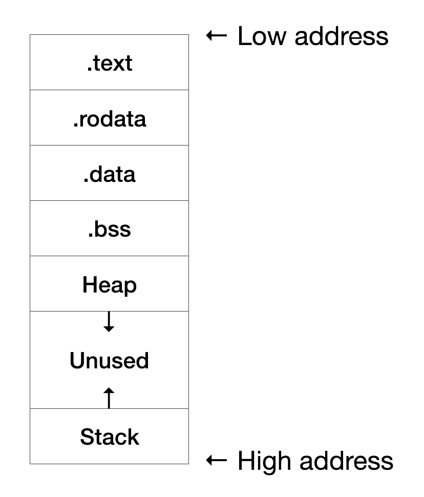
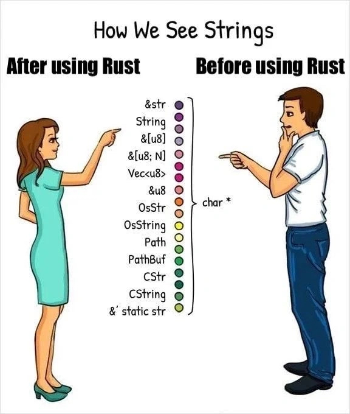

# 前言

## 实验概述

学习Rust保障内存安全的各类机制：所有权、引用、生命周期，了解Rust智能指针的用途，最后进行实践学习

> 前排提示：该章内容比较容易眼高手低，原理会比较简单，但需要较多的实践，务必完成Rustlings练习

## 实验内容

1. 了解各类语言的内存管理措施
2. 学习所有权模型
3. 学习引用，可变引用，不可变引用，借用
4. 学习生命周期
5. 了解智能指针
6. 完成Rustlings练习

# 1. 各类语言的内存管理措施

## 1.1 内存分配与回收

计算机程序需要管理其所拥有的内存。一些语言采用垃圾回收（Garbage Collection）机制，在程序运行时不断地寻找并回收不再使用的内存，例如Java；在另一些语言中，开发者必须亲自分配和释放内存，例如C和C++。无论如何，这两种类型的语言需要面临内存分配和内存回收这两种基本需求。

内存分配的逻辑在多数语言中相同，但是内存回收就会各有区别。在有垃圾回收的语言中，GC记录并清除不再使用的内存，开发者不需要花精力去关注内存回收。然而，没有GC时，正确进行内存回收是一个容易出错的操作。我们需要精确地为一次内存分配配对一次内存释放。程序对内存的不当管理可能导致如下结果：

- 内存泄露：内存分配后忘记释放并回收内存。
- 释放后使用(Use After Free)：释放内存后仍通过变量访问已回收的内存空间。
- 二次释放（Double Free）：重复释放内存。

下面是这几种场景的C实现样例：

内存泄露：

```C
#include <stdlib.h>
int main() {
    int *ptr = malloc(sizeof(Something));
    do_many_things_without_ptr();
    return 0; // <---- The ptr is not reclaimed, resulting in a memory leak.
}
```

释放后使用：

```C
#include <stdlib.h>
int main() {
    int *ptr = malloc(sizeof(Something));
    some_use(ptr);
    free(ptr);
    some_use(ptr); // <---- Access ptr after the region is reclaimed.
    return 0;
}
```

二次释放：

```C
#include <stdlib.h>
int main() {
    int *ptr = malloc(sizeof(Something));
    some_use(ptr);
    free(ptr);
    free(ptr); // <---- Double free ptr.
    return 0;
}
```

一个和内存安全密切相关的概念是悬垂指针（Dangling Pointer，DP）或者悬垂引用（Dangling Reference），悬垂指针意味着能够访问已被释放的内存片段。在上面的例子中，释放后使用和二次释放都可以认为是分配的内存片段在第一次释放后，使用者仍使用`ptr`悬垂指针访问已释放内存片段所引发的。

## 1.2 程序内存布局与堆栈

了解内存管理前，我们需要对程序的内存布局有一定了解，一个典型的程序需要包含以下字段：



按照功能不同会分为下面这些段：

- .text 段：代码段，存放汇编代码
- .rodata 段：只读数据段，顾名思义里面存放只读数据，通常是程序中的常量
- .data 段：存放被初始化的可读写数据，通常保存程序中的全局变量
- .bss 段：存放被初始化为 0 的可读写数据，与 .data 段的不同之处在于我们知道它要被初始化为 0，因此在可执行文件中只需记录这个段的大小以及所在位置即可，而不用记录里面的数据，也不会实际占用二进制文件的空间
- Stack：栈，用来存储程序运行过程中的局部变量，以及负责函数调用时的各种机制。它从高地址向低地址增长
- Heap：堆，用来支持程序**运行过程中**内存的**动态分配**，比如说你要读进来一个字符串，在你写程序的时候你也不知道它的长度究竟为多少，于是你只能在运行过程中，知道了字符串的长度之后，再在堆中给这个字符串分配内存

**堆与栈**

许多编程语言并不要求你经常考虑堆栈。 但是，在 Rust 这样的系统编程语言中，一个值是在栈上还是在堆上会影响语言的行为方式，以及你必须做出某些决定的原因。

堆栈和堆都是内存的一部分，供代码在运行时使用，它们的特性和使用方式如下：

1. 这里的堆不是数据结构中的堆，而是一大块向操作系统申请的内存；栈与数据结构中的栈类似，按照后进先出的顺序存储值。
2. 所有在栈中存储的数据**必须有已知的固定大小**；编译时**大小未知或大小可能改变**的数据必须存储在堆上。
3. 当调用一个函数时，传入函数的值和函数的局部变量会被推入栈。

当程序希望在堆上分配数据时（将值推入堆栈不属于分配），内存分配器会在堆中找到足够大的空位，将其标记为正在使用，并返回一个指针，即该位置的地址。 该指针是已知的固定大小，因此可以将指针存储在堆栈上，当需要实际数据时，须根据指针访问数据。

参考并删减自：[Rust book: 堆与栈](https://doc.rust-lang.org/stable/book/ch04-01-what-is-ownership.html#the-stack-and-the-heap)

## 1.3 Rust内存管理

在了解Rust内存管理之前，需要简单回顾一下作用域（Scope）概念，在学习其他编程语言时应当见到过它。作用域是一个项在程序中有效的范围。下面示例注明了变量`s`的有效范围：

```Rust
{  // s1 and s2 are not valid here, they are not yet declared
    let s1 = "hello";  // s1 is valid from this point forward
    let s2 = String::from("hello");  // s2 is valid from this point forward
    // do stuff with s1 and s2
}  // this scope is now over, s1 and s2 are no longer valid
```

其中有两个重要的时间节点：

- 变量在作用域时，它就是有效的。
- 有效性一直持续到它离开作用域为止。

Rust采用的一种内存管理策略是，内存在拥有它的变量离开作用域后就被自动释放。在上面的示例中，当`s2`离开作用域，Rust会自动调用`Drop`函数（Drop为一个trait，所有结构都可以实现），在该函数实现中，`String`便可以进行释放内存操作。

> **初见生命周期与RAII**
>
> 在该场景中，变量离开作用域的就是生命周期结束的时刻，当变量离开作用域，其所拥有的内存资源也就不再被需要而被释放。结束时释放资源的模式被称作资源获取即初始化（Resource Acquisition Is Initialization，RAII），你也可以在C++（构造函数与析构函数）等语言中见到这种模式。

了解了Rust的内存管理后，我们将进一步探索Rust为确保内存安全（预防如释放后使用，二次释放）所提出的几个机制：（1）所有权模型；（2）引用与借用；（3）生命周期。

# 2. 所有权模型

所有权模型是Rust为了保障内存安全所提出的机制之一。Rust编译器在编译时会根据特定规则进行检查，这些检查只是为了保障内存安全，不会在运行时带来过多性能开销。所有权模型规定的规则如下:

- Rust 中每一个值都有一个被称为所有者的变量。
- 值在任一时刻有且只有一个所有者。
- 当所有者离开作用域，这个值将被丢弃。

让我们根据一个Rust案例具体分析所有权模型的机制：

```Rust
fn main() {
    // Case 1
    let s1 = String::from("hello");
    let s2 = s1;
    // println!("s1: {}", s1); // Compile error
    println!("s2: {}", s2);

    // Case 2
    let s1 = String::from("hello");
    {
        let s2 = s1;
        println!("s2: {}", s2);
    }
    // println!("s1: {}", s1); // Compile error

    // Case 3
    let x = 5;
    let y = x;
    println!("x: {}", x);
    println!("y: {}", y);
}
```

该例子包含三种小案例。让我们依次进行分析：

1. 第一个案例中，当声明并赋值s2时，s1便不可再用，此时发生了**所有权转移。**如果在之后打印s1，Rust编译器便会报错，因为该字符串的所有权已经转移给了s2，根据所有权规则，s1不再有效。
2. 第二个案例中同样发生了所有权转移，并且当s2释放后，所有权并没有回归到s1，因此在打印s1时Rust编译器仍然会报错。这里也引出了所有权模型不完善的一点，因为第二个案例在开发中十分常用，不能因为内存安全就放弃这种通用开发场景。为了解决这一问题，Rust提出了**引用和借用**的概念，并利用**生命周期**进行控制解决了这一问题并且达成了内存安全。这两点概念将会在之后的章节进行讲述。
3. 第三个案例出现了跟第一个案例完全不同的情况，即使声明并赋值y，x仍然有效并可以访问，这是因为Rust在这里进行了浅拷贝，直接将x的**值**复制给了y，**没有发生所有权转移**。除了浅拷贝，Rust还提供了深拷贝配套的`Clone` trait。

> **Rust中的浅拷贝与深拷贝**
>
> Rust同样包含其他编程语言中的浅拷贝（Shallow Copy）与深拷贝（Deep Copy）两种概念。
>
> - 浅拷贝：在上面的例子中，对`y`和`s2`的赋值均是浅拷贝，不同的是`x`为基础数据类型，可以直接将值赋给`y`；在`s2`的浅拷贝中，Rust同时无效了先前的变量，这个特殊操作在Rust被称为移动（Move）。
> - 深拷贝：Rust为深拷贝提供了克隆（Clone）trait，每一个结构体可以实现该trait并在其中实现深拷贝的具体逻辑。
>
> 需要注意的是，Rust 永远也不会隐式创建数据的“深拷贝”。因此，任何自动的复制可以被认为对运行时性能影响较小。下面是一个显式深拷贝的例子：
>
> ```Rust
> let s1 = String::from("hello");
> let s2 = s1.clone();
> println!("s1 = {}, s2 = {}", s1, s2);
> ```
>
> 参考链接：[【译】Rust中的Move、Copy和Clone](https://zhuanlan.zhihu.com/p/184907190)

# 3. 引用与借用

## 3.1 基础概念

**引用**（Reference）是Rust中为了让**多个变量同时访问同一个值**而提出的概念，其允许我们使用值但不获取其所有权。Rust将引用分为**不可变引用**与**可变引用**，并将创建一个引用的行为称为**借用**（Borrowing）。引用遵循如下规则：

- 在任意给定时间，要么只能有一个可变引用，要么只能有多个不可变引用。
- 引用必须总是有效的。

其中第二条规则依赖于生命周期检查；第一条规则则是通过静态检查达成，该规则使得Rust能够避免数据竞争，即同一时间只允许多个读者或者一个写者。同样，让我们根据一个Rust案例来学习引用的机制：

```Rust
// Ref: https://doc.rust-lang.org/book/ch04-02-references-and-borrowing.html

fn main() {
    let mut s1 = String::from("hello");
    let len = calculate_length(&s1);
    println!("The length of '{}' is {}.", s1, len);
    fill_string(&mut s1);
    println!("s1: {}", s1);

    // Case 2: Good one
    let s1 = String::from("hello");
    {
        let s2 = &s1;
        println!("s2: {}", s2);
    }
    println!("s1: {}", s1); // Ready to go!
}

fn calculate_length(s: &String) -> usize {
    // s.push_str(", world"); // Compile error
    s.len()
}

fn fill_string(some_string: &mut String) {
    println!("some_string: {}", some_string);
    some_string.push_str(", world");
}
```

该案例中，最后两个函数分别借用了s1的不可变引用和可变引用以完成函数功能。不可变引用和可变引用的使用和不可变变量和可变变量的使用如出一辙，对不可变引用进行修改操作会触发编译错误。`main`函数最后的一个案例和上一节的第二个案例类似，但是加上了引用后，便**不会触发所有权转移**，在s2被释放后仍可以访问s1。

接下来，让我们看一个更为复杂的例子，将不可变引用，可变引用，不可变变量，可变变量结合起来：

```rust
fn main() {
    let mut string = String::from("hello world");

    let ref_str = &string;
    // ref_str.push_str("!");
    println!("Updated string: {}", ref_str);

    // ref_str = &mut string;

    let mut ref_str = &string;
    // ref_str.push_str("!");
    println!("Updated string: {}", ref_str);

    ref_str = &string;
    // ref_str.push_str("!");
    println!("Updated string: {}", ref_str);

    let ref_str = &mut string;
    ref_str.push_str("!");
    println!("Updated string: {}", ref_str);

    // ref_str = &mut string;

    let mut ref_str = &mut string;
    ref_str.push_str("!");
    println!("Updated string: {}", ref_str);

    ref_str = &mut string;
    ref_str.push_str("!");
    println!("Updated string: {}", ref_str);
}

```

上面的代码展示了四种情况，其中注释行便是无法编译通过的代码：

1. 不可变变量 + 不可变引用
2. 可变变量 + 不可变引用
3. 不可变变量 + 可变引用
4. 可变变量 + 可变引用

总结来看，可变引用和不可变引用可以认为是一种**变量类型**，如果它附上了“可变变量”，那么我就可以将该引用转为另外一个变量的引用，但该**引用的可变和不可变属性不会被修改**。

## 3.2 切片类型（slice）

切片类型允许开发者使用集合中一段连续的序列，但不复制其中的元素。它的语法如下

```Rust
let a = [1, 2, 3, 4, 5];
let slice = &a[1..3];      // [2, 3]
```

上述例子中，我们使用 `..` 创建了一个序列，并使用 `[]` 取出了一个数组切片，用 `&` 得到了这个切片。注意切片的结果必须是引用类型，而且开发者必须使用 `&` 明示这一点。这个切片引用的类型是 `&[i32]` 。由于指针的长度可以在编译期确定，所以在类型中不用包括数组长度。

## 3.3 字符串类型

终于，在有了引用和切片作为基础后，我们可以了解Rust中的字符串类型。在Rust中，字符串类型是 `String` ，而字符串字面值是字符串切片引用（ `&str` ）类型。如下例

```Rust
fn main() {
    let s1: &str = "I am a str";
    let s2: String = String::from(s1);
    let s3 = String::from("I am a String");
}
```

`str` 是字符串切片（String Slice）， `&str` 是字符串切片引用。由于切片结果必须是引用，所以我们一般只会接触到 `&str` 和 `String` 。当我们需要对字符串进行复杂操作时，例如拼接、分隔等，就需要使用 `String` 类型。下面一张图展示了Rust中对于字符串的不同表达方式，其中有一些不太常用：



我们简单介绍几个常见的字符串代表形式：

1. &str：代表UTF-8字符串的一段slice
2. String：存储在堆上的字符串类型，与`Vec<u8>`相近
3. &[u8]：代表u8字节的一段slice，可以用来表示ASCII的切片

> `String` `&str` `str` 的区别详解，来自[Stack Overflow解答](https://stackoverflow.com/questions/24158114/what-are-the-differences-between-rusts-string-and-str)
>
> `String` is the dynamic heap string type, like `Vec`: use it when you need to own or modify your string data.
>
> `str` is an immutable sequence of UTF-8 bytes of dynamic length somewhere in memory. Since the size is unknown, one can only handle it behind a pointer. This means that `str` most commonly appears as `&str`: a reference to some UTF-8 data, normally called a "string slice" or just a "slice". [A slice](https://doc.rust-lang.org/book/ch04-03-slices.html) is just a view onto some data, and that data can be anywhere, e.g.
>
> **In static storage**: a string literal `"foo"` is a `&'static str`. The data is hardcoded into the executable and loaded into memory when the program runs.
>
> **Inside a heap allocated** **`String`**: `[String` dereferences to a `&str` view](<https://doc.rust-lang.org/std/string/struct.String.html#deref>) of the `String`'s data.
>
> **On the stack**: e.g. the following creates a stack-allocated byte array, and then gets a [view of that data as a &str](https://doc.rust-lang.org/std/str/fn.from_utf8.html):
>
> ```Rust
> use std::str;
> 
> let x: [u8; 3] = [b'a', b'b', b'c'];
> let stack_str: &str = str::from_utf8(&x).unwrap();
> ```
>
> In summary, use `String` if you need owned string data (like passing strings to other threads, or building them at runtime), and use `&str` if you only need a view of a string.
>
> This is identical to the relationship between a vector `Vec<T>` and a slice `&[T]`, and is similar to the relationship between by-value `T` and by-reference `&T` for general types.

# 4. 生命周期

在前一节提到，引用的**有效**要求依赖于生命周期检查。否则会导致引用指向的数据可能被释放，产生悬垂引用。让我们看一个能产生悬垂引用，无法通过Rust编译器的案例：

```Rust
// credit: https://doc.rust-lang.org/book/ch10-03-lifetime-syntax.html
fn main() {
    let r;                // ---------+-- 'a
                          //          |
    {                     //          |
        let x = 5;        // -+-- 'b  |
        r = &x;           //  |       |
    }                     // -+       |
                          //          |
    println!("r: {}", r); //          |
}                         // ---------+
/*
$ cargo run
   Compiling playground v0.0.1 (/playground)
error[E0597]: `x` does not live long enough
 --> src/main.rs:6:13
  |
5 |         let x = 5;        // -+-- 'b  |
  |             - binding `x` declared here
6 |         r = &x;           //  |       |
  |             ^^ borrowed value does not live long enough
7 |     }                     // -+       |
  |     - `x` dropped here while still borrowed
8 |                           //          |
9 |     println!("r: {}", r); //          |
  |                       - borrow later used here

For more information about this error, try `rustc --explain E0597`.
error: could not compile `playground` (bin "playground") due to 1 previous error
*/
```

代码中`r`拥有生命周期`'a`，但其引用了一个更小生命周期`'b`的对象，并在`'b`结束后尝试访问已经被释放的内存，使得`r`成为了悬垂引用。正确的情况是，`r`引用的对象的生命周期应当不小于`r`本身的生命周期，防止产生悬垂引用。

Rust在某些情况下能自动推断出变量的生命周期，然而仍存在一些情况需要进行手动标注，下面是一个标注了生命周期的例子，其中`'a`是生命周期标注语法，注意到其中`<'a>`是用到了泛型标注的语法。

```Rust
// credit: https://doc.rust-lang.org/book/ch10-03-lifetime-syntax.html
fn main() {
    let string1 = String::from("abcd");
    let string2 = "xyz";
    let result = longest(string1.as_str(), string2);
    println!("The longest string is {}", result);
}
fn longest<'a>(x: &'a str, y: &'a str) -> &'a str {
    if x.len() > y.len() {
        x
    } else {
        y
    }
}
```

函数或方法的参数的生命周期被称为输入生命周期（Input Lifetimes），返回值的生命周期被称为输出生命周期（Output Lifetimes）。生命周期标注语法正是将函数的一个或多个输入生命周期与输出生命周期关联，以指导Rust编译时的生命周期检查。上例中的生命周期标注指出输出生命周期（即被`'a`所替代的具体生命周期）必须与两个输入生命周期的较小者一致，确保作为返回值的引用总是有效的。

> **生命周期自动标注的常见模式**
>
> 根据官方文档，Rust开发团队总结了生命周期标注的几个常见模式，将其编码到Rust编译器中，使得借用检查器在这些情况下能够推断出生命周期，而不强制开发者显式地标注。这些模式被称为生命周期省略规则（Lifetime Elision Rules），目前有三条规则：
>
> 1. 每一个是引用的参数都有它自己的生命周期参数。换句话说就是，有一个引用参数的函数有一个生命周期参数：`fn foo<'a>(x: &'a i32)`，有两个引用参数的函数有两个不同的生命周期参数，`fn foo<'a, 'b>(x: &'a i32, y: &'b i32)`，依此类推。
> 2. 如果只有一个输入生命周期参数，那么它被赋予所有输出生命周期参数：`fn foo<'a>(x: &'a i32) -> &'a i32`。
> 3. 如果方法有多个输入生命周期参数并且其中一个参数是`&self`或`&mut self`，说明这是个对象实例的方法, 那么所有输出生命周期参数被赋予`self`的生命周期。
>
> 下面来看两个应用生命周期省略规则的例子：
>
> - `fn first_word(s: &str) -> &str {`由前两条规则推断为`fn first_word<'a>(s: &'a str) -> &'a str {`。
> - `fn longest(x: &str, y: &str) -> &str {`由第一条规则推断为`fn longest<'a, 'b>(x: &'a str, y: &'b str) -> &str {`，编译器不能自动推断得到输出生命周期，我们在前面已经知道在不手动标注生命周期时这个例子会报错。
>
> `'`**`static`生命周期**
>
> Rust中存在一个特殊生命周期`'static`，表示数据存活于整个程序的运行期。所有的字符串字面值都拥有`'static`生命周期，例如`let s: &'static str = "live looooooong";`。Rust编译时报错有时会建议使用`'static`标注来修复问题，不过将引用指定为 'static 之前，需要考虑这个引用是否应当在整个程序的生命周期里都有效。大部分情况中，代码中的问题是尝试创建一个悬垂引用或者可用的生命周期不匹配，你需要解决这些问题而不是指定一个 `'static` 的生命周期。

在下例中我们修改了上例的`main`函数，使得第二个函数参数的输入生命周期小于函数输出生命周期，因而这段代码不能通过编译。

```Rust
// credit: https://doc.rust-lang.org/book/ch10-03-lifetime-syntax.html
fn main() {
    let string1 = String::from("long string is long");
    let result;
    {
        let string2 = String::from("xyz");
        result = longest(string1.as_str(), string2.as_str());
    }
    println!("The longest string is {}", result);
}
```

进一步的，让我们来看另一个例子：

```rust
fn longest_with_one<'a>(x: &[u8], y: &'a [u8]) -> &'a [u8] {
    if x.len() > y.len() {
        println!("x long!");
    } else {
        println!("y long!");
    }
    // x
    y
}

fn longest_without_ret(x: &[u8], y: &[u8]) {
    if x.len() > y.len() {
        println!("x long!");
    } else {
        println!("y long!");
    }
}
```

例子中的`longest_without_ret`因没有返回值，所以无需对生命周期进行标注，而`longest_with_one`与上面的`longest`函数不同，它只将生命周期标记到了y上面，该措施会让Rust编译器认为返回的生命周期关联到y上，但这会带来一个限制，即此时就无法返回x，只能返回y。

在之前声明的结构体中，所有结构体必须拥有其各个字段的所有权，在了解引用和生命周期的概念后，我们可以在结构体中使用引用，例如在下面的例子中，我们指示`ImportantExcerpt`实例不能比字段中的引用存在更久：

```Rust
// credit: https://doc.rust-lang.org/book/ch10-03-lifetime-syntax.html
struct ImportantExcerpt<'a> {
    part: &'a str,
}
fn main() {
    let novel = String::from("Call me Ishmael. Some years ago...");
    let first_sentence = novel.split('.').next().expect("Could not find a '.'");
    let i = ImportantExcerpt {
        part: first_sentence,
    };
}
```

# 5. 智能指针

Rust中存在一系列的智能指针，在开发中会经常用到这些指针来实现特定的功能：

- Box\<T\>: Box主要是为了让新建的结构体分配到堆上，减少栈用量防止栈溢出，可以使用`Box::new(val)`来创建一个Box智能指针，创建完成后访问内部值与自动摧毁依靠Deref和Drop trait来进行
- Rc\<T\>: 很多情况下，我们很准确的知道哪个变量拥有哪个值，但有些情况下一个变量可能有多个所有者（需注意的是，引用不属于拥有值，因此需要生命周期来做检查），因此Rust提出了Rc来解决这一问题，通过在运行时进行引用计数来决定是否释放该值，其名称为Reference counting（引用计数），并拥有四个特性：(1) 多个变量可以"拥有"该值。（2）当所有变量均被摧毁后才会回收；（3）内部不可变，只能读取；（4）只能在单线程中使用
- Arc\<T\>: Arc是原子引用计数，是Rc的增强版，Rc只能在单线程中使用，Arc在带来额外开销的同时保证了在多线程上的安全性。
- RefCell\<T\>: 有些情况下我们需要在拥有不可变引用的情况下对某些值进行改变，因此出现了RefCell，该结构体具有内部可变性的性质，即允许不可变引用改变内部值。RefCell仍然遵守Rust对于不可变引用和可变引用的限制，将编译期的引用检查放到了运行时，如果运行时不满足引用限制，则会panic。

# 6. Rustlings练习与参考资料

与lab1类似，lab2提供了特定的Rustlings练习题，可以通过以下指令安装

```Shell
git clone -b week2 https://github.com/sdww0/rustlings-exercies.git
cargo install --path ./rustlings-exercies
```

使用Rustlings创建并运行week2练习，在运行完成后可以按照命令行提示的信息进行对应操作（next，hint，list，quit）：

```Shell
rustlings init
cd rustlings
rustlings
```

参考资料：

1. [Rust内存泄露相关](https://doc.rust-lang.org/book/ch15-06-reference-cycles.html)
2. [Rust标量类型](https://doc.rust-lang.org/rust-by-example/primitives.html#scalar-types)
3. [Rust 2018通过非词法作用域生命周期（Non-Lexical Lifetimes，NLL）前移了引用的作用域结束的位置](https://blog.rust-lang.org/2018/12/06/Rust-1.31-and-rust-2018.html#non-lexical-lifetimes)
4. [Rust数据竞争与竞态条件（Race Condition）相关](https://doc.rust-lang.org/nomicon/races.html)
5. [Rust部分移动相关](https://doc.rust-lang.org/rust-by-example/scope/move/partial_move.html)
