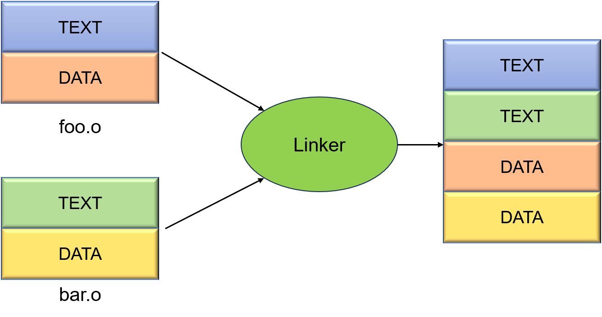

# 0. 前言

## 实验概述

了解QEMU启动流程，基于OSDK运行Hello World内核

## 实验内容

1. 了解实验背景，RISC-V与Asterinas
2. 配置实验所需的环境，安装OSDK
3. 基于OSDK编写并运行Hello World内核
4. 基于Hello World内核，跟踪系统启动流程

## 实验环境安装

在原有的summer-ospp-teaching-os中运行`./lab3/env-setup.sh`：

```shell
git pull && bash ./lab3/env-setup.sh
```

或重新克隆仓库并运行：

```shell
sudo apt install -y git
git clone https://github.com/asterinas/summer-ospp-teaching-os.git
cd summer-ospp-teaching-os && bash ./lab3/env-setup.sh
```

# 1. 实验背景

## RISC-V

RISC发明者是美国加州大学伯克利分校教师David Patterson，RISC-V（读作risk-five）是第五代精简指令集，也是由David Patterson指导的项目。2010年伯克利大学并行计算实验室(Par Lab) 的1位教授和2个研究生想要做一个项目，需要选一种计算机架构来做。当时面临的的是选择X86、ARM，还是其他指令集，不管选择哪个都或多或少有些问题，比如授权费价格高昂，不能开源，不能扩展更改等等。所以他们在2010年5月开始规划自己做一个新的、开源的指令集，就是RISC-V。

**RISC-V特点**

1. **模块化的指令子集**。RISC-V的指令集使用模块化的方式进行组织，每一个模块使用一个英文字母来表示。RISC-V最基本也是唯一强制要求实现的指令集部分是由I字母表示的基本整数指令子集，使用该整数指令子集，便能够实现完整的软件编译器。其他的指令子集部分均为可选的模块，具有代表性的模块包括M/A/F/D/C。
2. **规整的指令编码**。RISC-V的指令集编码非常的规整，指令所需的通用寄存器的索引（Index）都被放在固定的位置。因此指令译码器（Instruction Decoder）可以非常便捷的译码出寄存器索引然后读取通用寄存器组（Register File，Regfile）。
3. **优雅的压缩指令子集**。基本的RISC-V基本整数指令子集（字母I表示 ）规定的指令长度均为等长的32位，这种等长指令定义使得仅支持整数指令子集的基本RISC-V CPU非常容易设计。但是等长的32位编码指令也会造成代码体积（Code Size）相对较大的问题。为了满足某些对于代码体积要求较高的场景（譬如嵌入式领域），RISC-V定义了一种可选的压缩（Compressed）指令子集，由字母C表示，也可以由RVC表示。RISC-V具有后发优势，从一开始便规划了压缩指令，预留了足够的编码空间，16位长指令与普通的32位长指令可以无缝自由地交织在一起，处理器也没有定义额外的状态。
4. **特权模式**。RISC-V架构定义了三种工作模式，又称特权模式（Privileged Mode）：Machine Mode：机器模式，简称M Mode。Supervisor Mode：监督模式，简称S Mode。User Mode： 用户模式，简称U Mode。RISC-V架构定义M Mode为必选模式，另外两种为可选模式。通过不同的模式组合可以实现不同的系统。
5. **自定制指令扩展**。除了上述阐述的模块化指令子集的可扩展、可选择，RISC-V架构还有一个非常重要的特性，那就是支持第三方的扩展。用户可以扩展自己的指令子集，RISC-V预留了大量的指令编码空间用于用户的自定义扩展，同时，还定义了四条Custom指令可供用户直接使用，每条Custom指令都有几个比特位的子编码空间预留，因此，用户可以直接使用四条Custom指令扩展 出几十条自定义的指令。

**参考资料:**

1. [RISCV手册中文版](http://staff.ustc.edu.cn/~llxx/cod/reference_books/RISC-V-Reader-Chinese-v2p12017.pdf)
2. [特权级架构简介](https://tools.cloudbear.ru/docs/riscv-privileged-1.12-20211203.pdf)
3. [RISCV汇编手册](https://github.com/riscv-non-isa/riscv-asm-manual)

## Asterinas

来自GitHub的介绍：Asterinas（星绽）是一个*安全*、*快速*、*通用*的操作系统内核。 它提供与Linux相同的ABI，可无缝运行Linux应用， 但比Linux更加*内存安全*和*开发者友好*。

- 星绽在内存安全性方面远胜Linux。 它使用Rust作为唯一的编程语言， 并将*unsafe Rust*的使用限制在一个明确定义且最小的可信计算基础（TCB）上。 这种新颖的方法， 被称为[框内核架构](https://asterinas.github.io/book/kernel/the-framekernel-architecture.html)， 使星绽成为一个更安全、更可靠的内核选择。
- 星绽在开发者友好性方面优于Linux。 它赋能内核开发者们 （1）使用生产力更高的Rust编程语言， （2）利用一个专为内核开发者设计的工具包（称为[OSDK](https://asterinas.github.io/book/osdk/guide/index.html)）来简化他们的工作流程， （3）享受MPL所带来的灵活性， 可自由选择开源或闭源他们为星绽所开发的内核模块或驱动。

# 2. OSDK介绍与Hello World内核

## 2.1 OSDK介绍

OSDK (Operating System Development Kit)的设计目标是简化Rust操作系统的开发流程。该工具提供一个命令行工具称为`cargo-osdk`。 `cargo-osdk`可以在Cargo的基础是作为子命令使用，尽可能将Rust操作系统的编译，运行，测试的流程与普通Rust程序开发一致。

通过输入`cargo osdk`，我们可以获得OSDK的所有命令（注：命令可能会随着更新出现调整），其中最常用的命令有：

1. new: Create a new kernel package or library package which depends on OSTD.
2. build: Compile the project and its dependencies
3. run: Run the kernel with a VMM
4. test: Execute kernel mode unit test by starting a VMM

在本节中我们将会使用`cargo osdk new`来新建一个Hello World内核，通过`run`来运行内核。

> **OSDK与操作系统开发**
>
> OSDK为Rust操作系统的开发带来了以下好处：
>
> 1. OSDK与集成库提供操作系统基础功能，如线程创建，端口访问，中断处理等机制。开发者可以忽略这些底层功能的开发，集中在操作系统的功能实现上，降低操作系统功能的开发门槛与前置工作量。
> 2. OSDK与集成库提供了一套操作系统通用库的开发工具。开发者可以通过使用OSDK与集成库来复用其他操作系统所编写的系统组件。
> 3. OSDK与集成库提供了一套简单的系统测试工具。开发者在进行操作系统测试时可以像普通Rust程序一样进行测试用例的编写与运行。
> 4. OSDK与集成库可以避免开发者使用unsafe，带来更安全的系统开发。
>
> **Unsafe关键字**
>
> 在lab1的时候我们简单介绍过`unsafe`关键字，但并没有展开说明：操作系统开发中会存在一些需要绕过Rust安全模型的情况（即使用`unsafe`），例如和硬件交互，根据指针访问特定地址。为了应对这种情况，Rust提供了 `unsafe` 关键字来绕过Rust的安全模型。具体地说，它允许我们使用以下五种操作
>
> - 解引用裸指针
> - 调用不安全的函数和方法
> - 访问或修改可变静态变量
> - 实现不安全的trait
> - 访问union的字段
>
> 我们将会在之后的课程学习中逐步踏入unsafe的领域，以学习操作系统底层架构。

## 2.2 创建Hello World内核

与`cargo new`不同，OSDK默认创建的是一个操作系统组件而非一个真正的内核，因此我们需要指定新建的项目为内核：`cargo osdk new --kernel hello-world-os`，创建后的项目结构为：

```shell
$ tree
.
├── Cargo.toml
├── OSDK.toml
├── rust-toolchain.toml
└── src
    └── lib.rs

1 directory, 4 files
```

1. `Cargo.toml`为Rust项目配置文件，OSDK会默认将OSTD加入到依赖当中以支持开发，并将OSDK所使用的临时目录排除在工作区外。
2. `OSDK.toml`为该Rust操作系统项目的配置文件，里面会指定项目类型，系统启动方式，与QEMU的启动参数。感兴趣的同学可以查看Asterinas对于[配置文件的各字段介绍](https://asterinas.github.io/book/osdk/reference/manifest.html)。
3. `rust-toolchain.toml`指定了该Rust项目的工具链以及操作系统编译必须添加的组件，在本学期的实验课中不会修改该配置文件
4. `src/lib.rs`为该Rust操作系统项目的主文件，默认为：

```Rust
#![no_std]
#![deny(unsafe_code)]

use ostd::prelude::*;

#[ostd::main]
fn kernel_main() {
    println!("Hello world from guest kernel!");
}
```

Rust操作系统和普通Rust程序的开发会有一些区别，可以通过对该文件解析来一步步分析：

1. `#![no_std]`： 该字段表明该Rust项目不会使用到std库，可以运行在裸机环境下而无需Linux/Windows作为基础环境。
2. `#![deny(unsafe_code)]`：该字段会让编译器在编译该库时一旦遇到unsafe代码，就会触发编译错误。
3. `#[ostd::main]`：该字段用于表明OSTD初始化完成后进入到的os函数入口，里面的函数目前只会打印一条输出信息。

## 2.3 Rust中的core、alloc与std

Rust身为系统编程语言，相比其他语言提供了很好的非标准环境支持，允许我们在非Linux/Windows平台开发程序并且能使用到Rust提供的一些官方数据结构工具。Rust的标准库分成了多个库，在这里我们简要介绍三个库以及它们之间的关系：**core**、**alloc**与**std**：

1. core是Rust中最基础的库，绝大多数平台和场景都可以使用这个库并且成功编译，里面会提供如获取数据结构大小，原子类型等工具。

2. alloc是Rust中提供智能指针和集合工具的库，这些工具的内容会存储在堆上，因此它需要依靠一个全局的堆分配器来分配堆内存。
3. std是可移植Rust软件的基石，它需要依赖于操作系统如Linux或Windows，并提供了Rust开发的核心类型。

在Rust操作系统开发中我们需要为每一个库都加入`#![no_std]`这一个字段，原因在于Rust的std库需要使用到操作系统平台提供的许多服务，这些服务在我们的操作系统运行中是没有的。

Rust std库虽不能使用，但操作系统开发却可以使用到core和alloc的内容，避免重复造轮子。很多重要的数据结构，比如`Vec<T>`、`Box<T>`等均是在core和alloc库中，因此操作系统开发能使用到Rust非常丰富的数据结构工具，实际上，std库中的很多内容是直接引用并暴露core和alloc的所有内容。

虽然操作系统开发可以使用core和alloc，但我们仍然需要给他们提供一些接口后才能使用。因缺少了std库，有一些实现在std中的内容需要操作系统来代替实现：

- 需要提供一个称为`panic_handler`的函数，这个函数会作为入口，当系统崩溃如调用`panic!()`或`.unwrap()`失败时调用该函数
- 如我们需要用到alloc，那么便需要注册一个全局的堆内存分配器，当其他地方使用到了alloc提供的数据结构且堆内存不足时，便会调用提供的堆内存分配器，同理，如内存无需再使用也会调用提供的释放函数。

在OSDK & OSTD的开发中，对开发者忽略了这些开发细节，但我们可以找到这些细节的所在地，在hello-world-os中，使用osdk编译后，可以在`target/osdk/hello-world-os-run-base`下找到这些隐藏的细节：

```rust
#![no_std]
#![no_main]

#![feature(linkage)]

extern crate hello_world_os;

#[panic_handler]
fn panic(info: &core::panic::PanicInfo) -> ! {
    extern "Rust" {
        pub fn __ostd_panic_handler(info: &core::panic::PanicInfo) -> !;
    }
    unsafe { __ostd_panic_handler(info); }
}

mod default_frame_allocator {
    use ostd::mm::frame::GlobalFrameAllocator;

    use osdk_frame_allocator::FrameAllocator;
    static FRAME_ALLOCATOR: FrameAllocator = FrameAllocator;

    #[no_mangle]
    #[linkage = "weak"]
    static __GLOBAL_FRAME_ALLOCATOR_REF: &'static dyn GlobalFrameAllocator = &FRAME_ALLOCATOR;
}

mod default_heap_allocator {
    use ostd::mm::heap::GlobalHeapAllocator;

    use osdk_heap_allocator::{HeapAllocator, type_from_layout};
    static HEAP_ALLOCATOR: HeapAllocator = HeapAllocator;

    #[no_mangle]
    #[linkage = "weak"]
    static __GLOBAL_HEAP_ALLOCATOR_REF: &'static dyn GlobalHeapAllocator = &HEAP_ALLOCATOR;

    #[no_mangle]
    #[linkage = "weak"]
    #[expect(non_snake_case)]
    fn __GLOBAL_HEAP_SLOT_INFO_FROM_LAYOUT(layout: core::alloc::Layout) -> Option<ostd::mm::heap::SlotInfo> {
        type_from_layout(layout)
    }
}

```

其中的`#![no_std]`即是禁用std库标志，`#[panic_handler]`即是崩溃处理函数，`default_heap_allocator`即是默认的堆内存分配器，其余的简介为：

1. `#![no_main]`：该字段会禁止可执行二进制文件发布`main`符号，阻止当前crate的main函数执行，一般在系统指定其它程序入口的时候使用。
2. `#![feature(linkage)]`：该宏为启用Rust的linkage特性，常见于Rust nightly版本中启用尚未稳定的特性。
3. `default_frame_allocator`：提供了操作系统大块内存分配器的实现，用于管理空闲的物理内存，我们将暂时忽略掉该字段

## 2.4 运行Hello World内核

OSDK生成的模板可能没考虑到非Docker环境的开发，且默认为x86平台，因此我们在此给出修改后的OSDK.toml配置文件:

```toml
project_type = "kernel"

[boot]
method = "qemu-direct"

[build]
strip_elf = false

[qemu]
args = """\
    -cpu rv64,zba=true,zbb=true \
    -machine virt \
    -m 1G \
    --no-reboot \
    -nographic \
    -display none \
    -serial chardev:mux \
    -monitor chardev:mux \
    -chardev stdio,id=mux,mux=on,signal=off,logfile=qemu.log \
"""
```

在`hello-world-os`的目录下输入`cargo osdk run --target-arch=riscv64` 即可启动一个QEMU然后运行Hello World内核，可以从输出中看到`Hello world from guest kernel!`。需要注意的是，在输出后系统会直接panic，因为操作系统是需要在不断地循环里面处理各种请求并提供服务，在我们的程序因没有进行循环等待，也没有创建一个用于等待的Task，因此导致ostd无法确定下一步应当做什么，使得它触发了系统崩溃。

## 2.5 总结

编译与启动阶段：

1. **创建项目：**OSDK根据自身包含的项目模板，创建一个依赖于OSTD的Rust项目，并加入Rust操作系统中的特殊处理如`no_std`, `no_main`等。
2. **编译项目：**Rust编译器编译内核代码，在其中OSDK提供的宏会标记我们提供的入口函数。
3. **启动准备：**根据启动协议的不同，OSDK此时会对二进制程序进行特殊处理，例如打包成协议特定的文件。
4. **启动阶段：**根据`OSDK.toml`中配置的启动信息，执行QEMU程序。

# 3. 系统启动流程

本节中我们将会打通从操作系统入口到`ostd::main`的路径。

## 3.1 操作系统的第一条指令

### 3.1.1 Bootloader (OpenSBI/RustSBI)

我们需要硬盘上的程序和数据。比如崭新的windows电脑里C盘已经被占据的二三十GB空间，除去预装的应用软件，还有一部分是windows操作系统的内核。在插上电源开机之后，就需要运行操作系统的内核，然后由操作系统来管理计算机。

问题在于，操作系统作为一个程序，必须加载到内存里才能执行。而“把操作系统加载到内存里”这件事情，不是操作系统自己能做到的，需要一个名为Bootloader的加载器来辅助加载。在RISC-V中，OpenSBI便是这样的角色，他是RISC-V SBI specification的一种开源实现。

**常规操作系统的启动过程：**

1. 开机自检
2. 固件（如BIOS）启动，进行硬件环境初始化，加载并启动Bootloader
3. Bootloader将操作系统内核代码加载（load）到内存中，并且启动（boot）操作系统
4. 操作系统启动

> 在计算机中，**固件(firmware)**是一种特定的计算机软件，它为设备的特定硬件提供低级控制，也可以进一步加载其他软件。固件可以为设备更复杂的软件（如操作系统）提供标准化的操作环境。对于不太复杂的设备，固件可以直接充当设备的完整操作系统，执行所有控制、监视和数据 操作功能。 在基于 x86 的计算机系统中, BIOS 或 UEFI 是固件；在基于RISCV的计算机系统中，OpenSBI是运行在**M态（M-mode）**的固件。
>
> RISCV有四种特权级（privilege level）。 其粗略的分类为： U-mode是用户程序、应用程序的特权级，S-mode是操作系统内核的特权级，M-mode是固件的特权级。
>
>
> | Level | Encoding | 全称             | 简称 |
> | ----- | -------- | ---------------- | ---- |
> | 0     | 00       | User/Application | U    |
> | 1     | 01       | Supervisor       | S    |
> | 2     | 10       |                  |      |
> | 3     | 11       | Machine          | M    |

### 3.1.2 链接器

在RISC-V中，我们会使用OpenSBI来作为bootloader，加载并启动操作系统。OpenSBI工作完成后，总会把program counter跳到`0x80200000`这个内存地址开始执行，所以我们要把操作系统镜像放在这个位置上，该操作便是由**链接器**完成的。链接器的作用是把输入文件(往往是 .o文件)链接成输出文件(往往是elf文件)。一般来说，输入文件和输出文件都有很多section, 链接脚本(linker script)的作用，就是描述怎样把输入文件的section映射到输出文件的section, 同时规定这些section的内存布局。



OSDK & OSTD在链接脚本`osdk/src/base_crate/riscv64.ld.template`里把操作系统的入口点定义为`_start`, 所以程序里需要有一个名称为`_start`的符号。因此`ostd/src/arch/riscv/boot/boot.S`编写了一段汇编代码, 里面包含`_start`作为整个内核的入口点。最后，在链接脚本中将`_start`作为二进制程序的开头，并将该地址设为`0x80200000`。

以下是OSDK提供的默认riscv64 linker，我们可以看到之前提到的data, bss等字段（节选，非全代码）：

```ld
ENTRY(_start)
OUTPUT_ARCH(riscv)

KERNEL_LMA = 0x80200000;
KERNEL_VMA = 0xffffffff80200000;
KERNEL_VMA_OFFSET = KERNEL_VMA - KERNEL_LMA;

SECTIONS
{
    # First, we use physical addresses for the boot sections.
    . = KERNEL_LMA;

    __kernel_start = . + KERNEL_VMA_OFFSET;

    .boot                   : AT(ADDR(.boot)) {
        KEEP(*(.boot))
        KEEP(*(.boot.stack))
        . = ALIGN(4096);
    }

    # Then, we switch to virtual addresses for all the other sections.
    . += KERNEL_VMA_OFFSET;

    .text                   : AT(ADDR(.text) - KERNEL_VMA_OFFSET) {
        *(.text .text.*)
        PROVIDE(__etext = .);
    }

    .rodata                 : AT(ADDR(.rodata) - KERNEL_VMA_OFFSET) {
        *(.rodata .rodata.*)
    }
    
    . = ALIGN(8);
    .eh_frame               : AT(ADDR(.eh_frame) - KERNEL_VMA_OFFSET) {
        PROVIDE(__eh_frame = .);
        KEEP(*(.eh_frame .eh_frame.*))
    }
    
    .data                   : AT(ADDR(.data) - KERNEL_VMA_OFFSET) {
        *(.data .data.*)
    }


    .bss                    : AT(ADDR(.bss) - KERNEL_VMA_OFFSET) {
        __bss = .;
        *(.bss .bss.*)
        __bss_end = .;
    }

    __kernel_end = .;
}
```

### 3.1.3 启动协议

Bootloader跳转到操作系统的第一条指令其实和一个函数调用十分相似，其中会涉及到特权级切换以及函数传参，以进行正常的启动流程。一般而言，bootloader会将一些特定的内容进行压栈或传入到特定的寄存器中，比如一些固件信息，或存储特定信息的指针，为了解析这些内容，就需要bootloader和操作系统有一套协议，这个就是boot protocol。下面简单介绍下RISC-V以及其他平台如x86中常见的bootloader与启动协议

- RISC-V：Bootloader：OpenSBI，它支持三种启动方式：（1）加载并根据跳转的二进制文件中指定地址来调整第一条指令地址；（2）固定下一级的跳转地址，如`0x80200000`；（3）payload：直接将跳转的二进制合并在一起，然后进行跳转，一般下一级有可能为另一个bootloader：u-boot。
- x86：Bootloader：GRUB，它是x86平台中非常常用的一种bootloader，比如x86 Linux就用它来进行引导和加载，它所实现的启动协议有比如Multiboot、Multiboot2等

## 3.2 从第一条指令到#[ostd::main]

从_start开始，一直查找函数调用可以得到以下调用链：

`_start` -> `riscv_boot` -> `call_ostd_main` -> `__ostd_main` -> `#[ostd::main]`

这些函数所做的事情有：

1. `_start`：系统基础入口，bootloader跳转到操作系统执行的第一个汇编函数。`_start`会进行一些最基础的操作，以支持Rust代码的正常执行。
2. `riscv_boot`：根据协议的不同，将获取系统信息的回调函数注册到系统的对应位置。
3. `call_ostd_main`：一个中间层，用于衔接上层到`__ostd_main`的调用。
4. `__ostd_main`：调用`ostd::init`进行基础功能初始化，随后调用`#[ostd::main]`标记的函数。

> `#[ostd::main]`是一个过程宏，它会根据传入的内容自动进行代码扩展，在索引的代码中我们可以找到以下关键代码：
>
> ```Rust
> quote!(
>     #[cfg(not(ktest))]
>     #[no_mangle]
>     extern "Rust" fn __ostd_main() -> ! {
>         let _: () = #main_fn_name();
> 
>         ostd::task::Task::yield_now();
>         unreachable!("`yield_now` in the boot context should not return");
>     }
> 
>     #[expect(unused)]
>     #main_fn
> )
> .into()
> ```
>
> 其中`quote!`我们可以忽略掉，关键在于里面的内容，其中有几个关键信息：
>
> 1. `extern "Rust" fn __ostd_main() -> ! { }`：该函数是ostd的主函数，通过extern "Rust"将该函数暴露给Rust程序的其他部分，更准确地说，该函数会在ostd的boot模块初始化完成后进行调用。该函数中会使用`ostd::init`来对系统进行早期初始化，之后调用我们提供的函数。
> 2. `#[no_mangle]` ：该标记会让Rust不对该函数名进行修改。Rust为每个函数进行了随机化处理，编写的函数名和编译后的函数名非常不一致，编译后的函数名中会包含大量随机的数字或者字符。因此这里使用no_mangle 来表明该函数名不能进行随机化处理，而是需要原有的名字暴露给其他地方，通过获取该符号来调用函数。
> 3. `#main_fn`：该函数即为我们编写的程序入口，具体为何是这样的标记在此处不再展开，感兴趣的同学可以阅读Rust过程宏的相关内容。

## 3.3 总结

Guest（QEMU）阶段：

1. **Bootloader:**Bootloader（OpenSBI）进行M-mode初始化，为加载操作系统进行支持。
2. **OSTD/boot:** Bootloader处理完成后，跳转到`0x8020_0000`地址处，并执行操作系统第一条指令，此时就进入到了boot模块，只是暂时还位于汇编代码区域。boot模块会进行两步操作，第一步在汇编语言中，为Rust系统之后的正常运行做些准备，第二步是在Rust语言中，将获取系统信息的回调函数注册到系统的对应位置。
3. **OSTD/init:** boot模块处理完毕后，会调用`call_ostd_main`，间接调用到`__ostd_main`中以进行系统基础功能初始化。OSTD系统的初始化较为复杂，之后的实验课会对部分内容进行分析。
4. **OS/main:** 待OSTD初始化完毕后，会调用`#[ostd::main]`标记的函数。最后打印出"Hello world from guest kernel!"。

# 4. 上手练习

1. 尝试模仿[Rust std环境下的测试用例](https://doc.rust-lang.org/book/ch11-01-writing-tests.html)，编写OSDK下的测试用例（Hint: Replace test with ktest) 测试程序：

   ```rust
   fn test_example() {
       assert_eq!(2 + 2, 4);
   }
   ```

   - 请你编写测试用例，并运行`cargo osdk test --target-arch=riscv64`，然后展示运行结果

2. OSTD采用了日志系统，可以通过指定不同的日志等级来获得不同输出，这些输出将会在之后的操作系统实验中带来非常有效的信息。（需要在依赖中加入`log = "0.4"`）尝试运行: `cargo osdk run --target-arch=riscv64 --kcmd-args="ostd.log_level=error"`来查看error等级的输出日志（默认），除此之外，可以用warn，info，debug，trace来代替命令中的error，以获得越来越详细的日志。
   1. 请你在代码中用5种日志等级输出不同的内容
   2. OSTD其实提供了日志格式化输出的函数调用接口（位置：`ostd::logger::inject_logger()`)，我们可以通过注册函数来达成自定义的日志输出格式，比如加一些不同颜色来快速定位DEBUG或ERROR日志信息，请你在上一步的基础上，注册格式化函数，用不同颜色渲染输出，然后用其中两个不同等级运行系统（需有区分度），展示运行结果。（Hint: 一种颜色输出库：<https://docs.rs/owo-colors/latest/owo_colors/；在Cargo.toml> 中的dependencies加入"log=0.4"，实现Log trait，其中只需要实现log函数，其余直接返回默认值即可）
