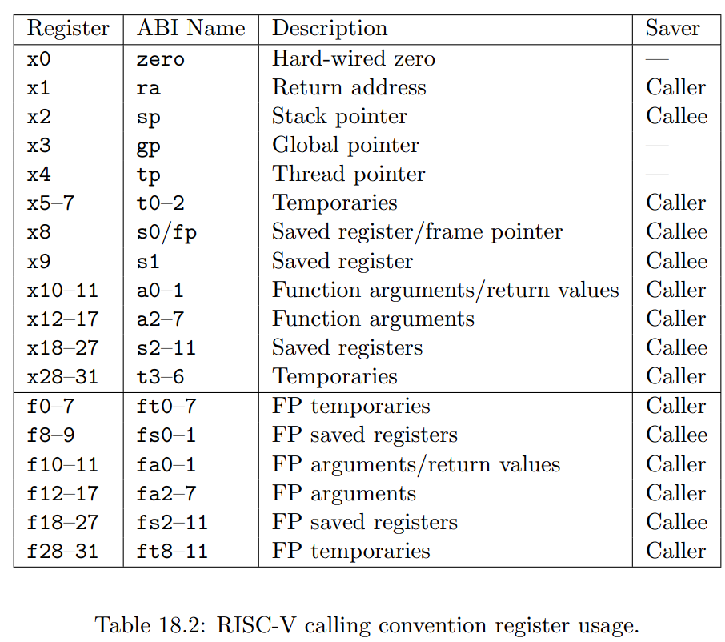

# 0. 前言

## 实验概述

构建最基础的进程控制块，了解异常与系统调用，并进行上手练习

## 实验环境安装

在原有的summer-ospp-teaching-os中运行`./lab4/env-setup.sh`：

```shell
git pull && bash ./lab4/env-setup.sh
```

或重新克隆仓库并运行：

```shell
sudo apt install -y git
git clone https://github.com/asterinas/summer-ospp-teaching-os.git
cd summer-ospp-teaching-os && bash ./lab4/env-setup.sh
```

## 实验代码

系统代码仓库在`summer-ospp-teaching-os/lab4/code`下，其代码结构为：

```
.
├── lib.rs  // System main
├── process  // PCB & User mode execution
│   └── mod.rs
└── syscall  // Syscall handling
    └── mod.rs

2 directories, 3 files
```

运行`run.sh`即可启动系统，默认会运行hello world的应用程序，如遇到系统直接崩溃，请使用`riscv64-unknown-elf-objdump -d ./target/hello`，并将`<_start>`的地址如`10078`或`100b0`替换到`create_user_context`函数下的ENTRY_POINT常量

# 1. 进程 - 简单实现

在这次课我们首先定义了一个非常简单的进程，以及它的控制块（PCB）：

```rust
pub struct Process {
    // ======================== Basic info of process ===========================
    /// The id of this process.
    pid: Pid,
    /// Process state
    status: AtomicU64,
    /// The threads of this process
    task: Once<Arc<Task>>,

    // ======================== Memory management ===============================
    vm_space: Arc<VmSpace>,
}
```

其中只会包含四个域：

- 进程id
- 进程状态
- 绑定的Task，Task是OSTD提供的一种**简单线程抽象**，它会允许我们在不同的上下文中运行代码，这样我们就可以在此基础上，构建进程
- 绑定的vm_space，简单认为其能允许我们对用户空间进行修改即可（SYS_WRITE会用到来读取用户字符串）

在我们目前的实现中，构建一个进程其实非常简单，只需要有几个步骤：

1. 构建vm_space，将用户程序的数据加载进内存，参考函数为：`src/process/mod.rs::create_vm_space`
2. 分配PID，一个自增的ID分配器即可
3. 构建Task，其会将一个函数传入到Task，以在运行时进入到该函数，参考为：`src/process/mod.rs::create_user_task`
4. 设置为Runnable，随后在主函数`src/lib.rs::main`中调用`Process::run`以运行

实际上，`Process::run`并不会立即进行上下文切换，而是会将该进程加入到可运行的队列中，不会立刻运行，在main函数返回时，OSTD会继续调用`ostd::task::Task::yield_now();`，如果我们在main函数的最后加上一个loop{}死循环，那么就永远不会运行进程了。

在切换到进程所指定的函数`src/process/mod.rs::create_user_task::user_task`后，便会设置用户态的一些信息，并在进入用户态不断地等待事件，然后为其提供服务，我们将在之后的章节中分析`user_task`的内容。

# 2. OSTD的用户态-内核态切换

在`src/process/mod.rs::crate_user_task`中可以看到有以下代码：

```rust
fn user_task() {
    let process = current_process();

    let mut user_mode = {
        let user_ctx = create_user_context();
        UserMode::new(user_ctx)
    };

    loop {
        let return_reason = user_mode.execute(|| false);
        ...
    }
}
```

其中`user_mode.execute(|| false)`函数会让OSTD根据我们构建的`UserMode`，进入到用户态，进一步看`UserMode`可以得到：

```rust
pub struct UserMode {
    context: UserContext,
}

/// Userspace CPU context, including general-purpose registers and exception information.
#[derive(Clone, Debug)]
#[repr(C)]
pub struct UserContext {
    user_context: RawUserContext,
    trap: Trap,
    cpu_exception_info: Option<CpuExceptionInfo>,
}

/// Saved registers on a trap.
#[derive(Debug, Default, Clone, Copy)]
#[repr(C)]
pub(in crate::arch) struct RawUserContext {
    /// General registers
    pub(in crate::arch) general: GeneralRegs,
    /// Supervisor Status
    pub(in crate::arch) sstatus: usize,
    /// Supervisor Exception Program Counter
    pub(in crate::arch) sepc: usize,
}
```

其中最底层我们会看到`RawUserContext`，该结构体封装了RISC-V平台下的通用寄存器`general`，Supervisor状态`sstatus`与Supervisor异常PC`sepc`：

1. `general`：存储了用户态通用寄存器状态，当切换到用户态时便会把加载里面的寄存器值，并在用户态返回时储存寄存器值
2. `sstatus`：代表的是RISC-V下的一个特殊寄存器，用于Supervisor的一些状态控制（如是否启用中断）和状态读取，该字段只会在汇编中用到，我们无需关注
3. `sepc`：代表的是RISC-V下的sepc寄存器，该寄存器会存储发生Trap时的指令地址

因此，从使用者的角度，我们仅需配置好用户态程序的通用寄存器，并将sepc设置为用户态程序的入口指令地址，就可以进入到用户态运行程序了

> **RISC-V通用寄存器的一些描述，作为参考**
>
> 

**内核上下文切换中，RISC-V常用CSR寄存器**

前面我们看到了除通用寄存器外，还有其他的特殊寄存器`sstatus`与`sepc`，这些寄存器称之为**CSR（Control and Status Register）**。内核上下文切换依赖于这些寄存器与`sret`指令协作完成，其中`sret`会将`sepc`的值存储进指令寄存器中，并设置当前特权级为用户态。OSTD的实现中使用了五个寄存器来协助切换：

1. `sscratch`：用户态和内核态切换上下文的一个中间寄存器，在OSTD中该字段用于存储内核栈，在用户态trap进内核态时，加载内核栈；在返回至用户态时，存储内核栈。PS：两个模式需要用到独立的通用寄存器，栈。
2. `stvec`：存放了用户态陷入到内核态时需要跳转的地址，在OSTD中这个地址会设置为`trap_entry`。
3. `scause`：提供当前中断或异常的类型信息，比如发生异常时，类型为`ebreak`还是`syscall`。
4. `sepc`：提供中断或异常发生时的指令地址，触发`sret`时将值存入指令寄存器中。
5. `stval`：提供中断或异常发生的附加信息。

# 3. 系统调用与异常

解析完内核态-用户态切换后，我们来继续看之前的代码：

```rust
loop {
    let return_reason = user_mode.execute(|| false);
    let user_context = user_mode.context_mut();
    match return_reason {
        ReturnReason::UserException => {
            ...
        }
        ReturnReason::UserSyscall => {
            ...
        }
        ReturnReason::KernelEvent => unreachable!(),
    }
}
```

其中`return_reason`代表了用户态程序陷入内核态的原因，包含三种不同的情况，分别为`UserSyscall`，`UserException`与`KernelEvent`：

1. `UserSyscall`代表系统调用。
2. `UserException`代表除系统调用之外的异常，如`ebreak`断点异常。需要注意的是，在RISCV中系统调用也归属于异常的一部分，但因为它是操作系统与用户应用程序的重要交互形式，因此OSTD在这里进行了区分。
3. `KernelEvent`是自定义的一种返回原因，在`user_mode.execute(|| false)`中的`(|| false)`即定义了`KernelEvent`会在什么时候触发，这里是永远都不会触发

> **Exceptions and Interrupts**
>
> 不同架构上对于异常 (Exception) 和中断 (Interrupt) 的定义可能不一致，来自RISCV手册对于两种概念的解释：
>
> 1. We use the term **exception** to refer to an unusual condition occurring at run time associated with an instruction in the current RISC-V hart.
> 2. We use the term **interrupt** to refer to an external asynchronous event that may cause a RISC-V hart to experience an unexpected transfer of control.
>

## 3.1 UserSyscall，系统调用

系统调用是操作系统为用户态运行的进程提供的一系列服务接口，这些接口可以允许用户态程序与硬件设备进行交互。该交互形式与正常的函数调用类似，只不过会新增一个用户态与内核态切换的开销。不同的架构中对于系统调用的寄存器用途会有不同的规范，在RISC-V中，我们一般使用**a0-a5作为系统调用的传递参数**，**a7作为系统调用号信息**，**a0作为系统调用返回值**。

在`src/syscall/lib.rs`中可以看到有`handle_syscall`函数，里面定义了两种系统调用，用于写入数据和退出进程：

```rust
pub fn handle_syscall(user_context: &mut UserContext, process: &Arc<Process>) {
    const SYS_WRITE: usize = 64;
    const SYS_EXIT: usize = 93;

    match user_context.a7() {
        SYS_WRITE => {
            ...
        }
        SYS_EXIT => {
            ...
        }
        _ => unimplemented!(),
    }
}

```

尝试运行脚本`run.sh`以运行代码，即可看到控制台会打印出用户态程序的Hello World。该打印是通过`SYS_WRITE`来实现的：

```rust
// Read buffer from user space
let (_, buf_addr, buf_len) = (user_context.a0(), user_context.a1(), user_context.a2());
let buf = {
    let mut buf = vec![0u8; buf_len];
    let mut reader = process.vm_space().reader(buf_addr, buf_len).unwrap();
    reader
        .read_fallible(&mut VmWriter::from(&mut buf as &mut [u8]))
        .unwrap();
    buf
};

// Write to stdout
println!("{}", str::from_utf8(&buf).unwrap());

user_context.set_a0(buf_len);
```

其中会额外设置返回值为`buf_len`，其原因是write这个系统调用遵守了POSIX标准，其会要求返回真正写入数据的长度。

> **POSIX标准**
>
> POSIX：可移植操作系统接口（Portable Operating System Interface of UNIX），提供了一套供操作系统遵循的准则来简化跨平台软件开发的任务。类Unix系统如Linux会采用该标准以复用庞大的用户态应用程序生态。
>
> POSIX准则会定义一系列的系统调用接口，比如在该项目中的SYS_WRITE与SYS_EXIT便是该接口规范中的对应系统调用号。
>
> **交叉编译**
>
> 在当前编译平台下（如x86），编译出的程序能运行在体系架构不同的另一个平台上（如RISCV或ARM），但编译平台却不能运行该程序。
>
> 在`run.sh`里面编译汇编程序时，我们没有使用`gcc`来进行编译，而是用了RISCV提供的交叉编译工具`riscv64-linux-gnu-gcc`来进行编译，这个原因是我们需要编译出不同平台的汇编程序，目前主流的pc机仍是以x86架构为主的CPU。

## 3.2 UserException，异常

`user/ebreak.S`程序会触发`ebreak`断点异常，该异常会作为`UserException`返回到我们的处理函数，目前我们会对所有的`UserException`进行panic。运行代码前首先需要启用该用户程序，将`src/lib.rs::main`函数替换为：

```rust
#[ostd::main]
pub fn main() {
    let program_binary = include_bytes!("../target/ebreak");
    // let program_binary = include_bytes!("../target/hello");
    let process = process::Process::new(program_binary);
    process.run();
}
```

随后运行`run.sh`，我们就能看到输出：

```text
Enter riscv_boot
Process 1 killed by exception: CpuExceptionInfo {
    code: Breakpoint,
    page_fault_addr: 0x0,
    error_code: 0x0,
}
```

其`code`域就被设为了`Breakpoint`类型的异常，异常的类型在RISC-V下有很多，Rust `riscv`库对于异常的定义有：

```rust
/// Exception
#[derive(Copy, Clone, Debug, Eq, PartialEq)]
#[repr(usize)]
pub enum Exception {
    InstructionMisaligned = 0,
    InstructionFault = 1,
    IllegalInstruction = 2,
    Breakpoint = 3,
    LoadMisaligned = 4,
    LoadFault = 5,
    StoreMisaligned = 6,
    StoreFault = 7,
    UserEnvCall = 8,
    SupervisorEnvCall = 9,
    InstructionPageFault = 12,
    LoadPageFault = 13,
    StorePageFault = 15,
    Unknown,
}
```

其中`UserEnvCall`即为系统调用，`Breakpoint`为ebreak触发。

> **Rust中的格式化输出**
>
> 我们之前打印CpuExceptionInfo时，其语句仅为`early_println!("Process {} killed by exception: {:#x?}", process.pid, exception);`，便可以输出格式化较好，且数字为十六进制的字符串（`format!`也可以达到一样的功能，但其返回的是格式化好的String），其归功于Rust对于格式化输出较为完善的支持。
>
> 该语句中打印了两个信息，第一个是用"{}"打印的pid，第二个是用"{:#x?}"打印的exception，第一个实际上是会调用Rust的Display trait（使用"{}"来调用），第二个是调用了Rust的Debug trait（使用"{:?}"来调用），其中第二个是可以通过简单加一行代码，在大部分情况下就可以让某个结构体用有这个能力，我们来看一下CpuExceptionInfo这个结构体：
>
> ```rust
> /// CPU exception information.
> #[derive(Clone, Copy, Debug)]
> #[repr(C)]
> pub struct CpuExceptionInfo {
>     /// The type of the exception.
>     pub code: Exception,
>     /// The error code associated with the exception.
>     pub page_fault_addr: usize,
>     pub error_code: usize, // TODO
> }
> ```
>
> 其中有一行`#[derive(Clone, Copy, Debug)]`，这个derive能为该结构体自动生成默认实现的代码，其中就包含了Debug，其会将每个字段都进行格式化输出，需要注意的是如果结构体内的某个类型没有实现Debug trait，那么就会报错，此时我们需要手动实现Debug trait。
>
> 在拥有了Debug trait之后，我们还可以对打印信息有一些调整，比如在例子中的"{:#x?}"，里面有两个额外的调整：(1) "#"，代表进行格式化，比如单行调整为多行输出，十六进制输出前面加上"0x"；（2）"x"，代表将“所有”的数字转为十六进制输出。这两个调整是Rust操作系统开发较为常用的，Rust还有很多其他的格式化形式，具体可以参考[Rust course](https://course.rs/basic/formatted-output.html)

# 5. 上手练习

本次课有两个简单的练习：

1. 在PCB中添加新的字段，实现新的系统调用，并在调用时输出该字段，在代码中全局搜索`TODO-1`即可找到需要添加或修改的地方、
2. 修改`SYS_EXIT`，使其仅将PCB中的状态设置为Zombie，并在其他地方检查状态后退出QEMU，在代码中全局搜索`TODO-2`即可找到需要添加或修改的地方
